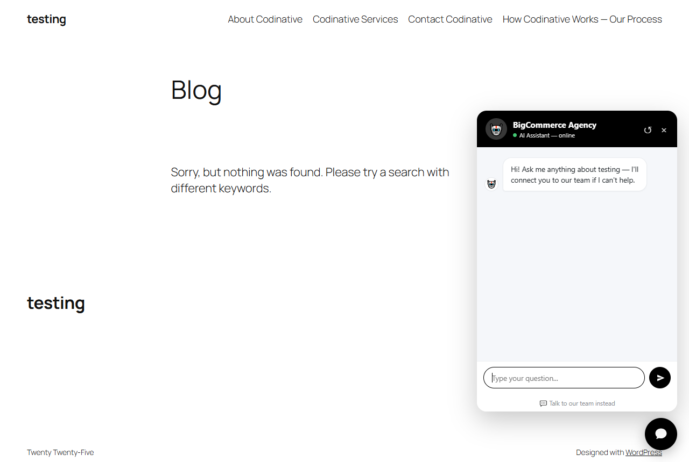
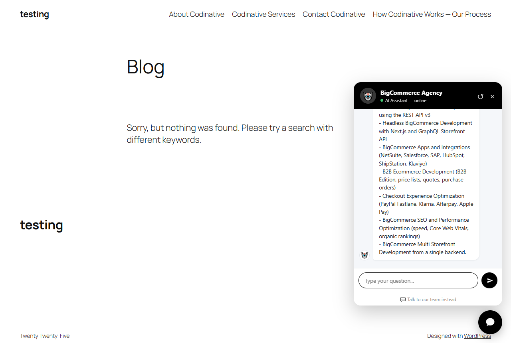
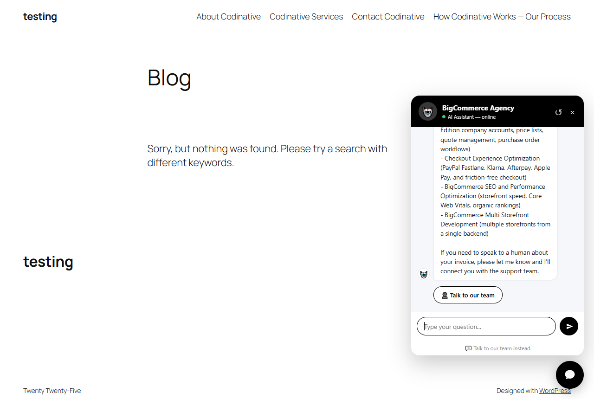
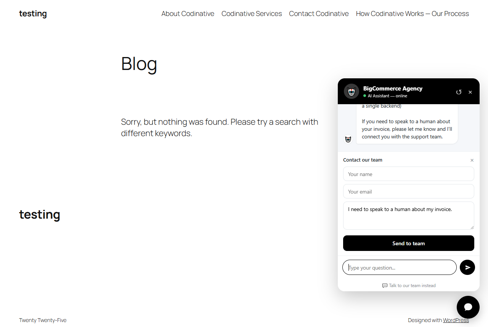

# AI Support Chat

> An AI chatbot trained on your own site content (RAG) with human handoff — it answers from what you publish, and escalates to a support ticket when it can't help.

**Version:** 1.3.1
**Author:** Noman Nadeem
**Requires:** PHP 7.4+, WordPress 5.6+ (REST API), a working `wp_mail`
**Dependencies:** none to install — Smalot PdfParser is vendored; no Composer, no npm, no build step

---

## Screenshots

Captured on a live install where the plugin was trained on a BigCommerce agency's own pages — the answers below come entirely from that site's content, not from the model's general knowledge.

| | |
|---|---|
|  **1. The launcher** — a single floating bubble, coloured from the Widget tab. |  **2. Opened panel** — your configured title and greeting. |
|  **3. A grounded answer** — the service list is quoted from the site's own indexed pages. |  **4. Handoff offered** — the visitor asked for a human, so the CTA appears. |



**5. The handoff form**, pre-filled with the visitor's unanswered question. Submitting it creates a Support Ticket with the full transcript and emails the team.

---

## What it does

1. A floating chat bubble appears on the front end (bottom-left or bottom-right).
2. A visitor asks a question.
3. The question is turned into an embedding, matched against every chunk of your published content, and the best 5 matches are injected into the prompt as CONTEXT.
4. The AI answers **only from that context** for factual questions — it is explicitly instructed not to invent names, roles, prices or relationships.
5. If it can't answer, or the visitor asks for a person, the model emits a `[HANDOFF]` marker and the widget shows a **👤 Talk to our team** button.
6. That opens a name / email / message form. Submitting it creates a **Support Ticket** containing the full chat transcript, and emails every address on your team list.
7. You reply from the ticket screen; the visitor gets a branded HTML email.

---

## Feature list

| Feature | Detail |
|---|---|
| RAG answering | Cosine similarity over stored embeddings, top 5 chunks above a 0.2 score threshold |
| Automatic indexing | `post`, `page` and uploaded documents re-index on every save; chunks are deleted on post delete or unpublish |
| ACF support | If Advanced Custom Fields is active, every ACF string value longer than 30 characters is indexed too |
| Knowledge documents | Upload PDF / DOCX / TXT / MD (≤10 MB) — text is extracted, chunked and embedded |
| Batched re-index | 2 posts per AJAX request with a live "N items remaining…" readout, so it survives PHP timeouts |
| Keyword fallback | If embeddings are unavailable, chunks are scored by term frequency instead — the bot degrades, it doesn't break |
| Canned replies | Greetings, thanks and goodbyes (English **and** romanised Urdu/Arabic: salam, assalam o alaikum, shukriya, allah hafiz, khuda hafiz) are answered instantly with no AI call |
| Human handoff | `[HANDOFF]` token → CTA button → contact form pre-filled with the visitor's unanswered question |
| Ticket system | Custom post type with transcript, chat-bubble conversation view, reply box that emails the visitor, replies logged as comments |
| Session memory | The last 6 **user** messages from the last 24 hours are replayed into the prompt |
| Multi-provider | OpenAI, Google Gemini, or OpenRouter — all via OpenAI-compatible REST endpoints |
| OpenRouter fallback chain | Up to 3 models tried in order, to survive free-tier rate limiting |
| Cross-origin embed | The same `chat.js` runs on external sites (e.g. a Next.js subdomain) with a `data-api` attribute; CORS is allow-listed per origin |
| Shadow DOM widget | `:host{all:initial}` — your theme can't break the widget, and the widget can't leak CSS into your theme |
| Appearance controls | Colour, position, title, greeting, font family, and show-on-all / include-list / exclude-list targeting |
| Rate limiting | 15 requests per minute per IP, shared across `/message` and `/handoff` |
| Clean uninstall | Drops both tables, deletes all documents and all plugin options — **tickets are deliberately kept** |

**Not included:** no shortcode, no Gutenberg block, no WP widget, no cron job, no streaming replies, no conversation-log screen, no analytics, no translations (the *admin UI* is English-only; the *bot* replies in the visitor's language).

---

## Installation

1. Copy the `ai-support-chat` folder into `wp-content/plugins/` (or upload the zip via **Plugins → Add New → Upload**).
2. Activate it. Activation creates two tables (`{prefix}asc_chunks`, `{prefix}asc_messages`) and adds two admin menus: **AI Support Chat** and **Support Tickets**.

> ⚠️ Tables are created **on activation only** — there is no DB-version upgrade routine. If a future version changes the schema, deactivate and reactivate.

---

## Setup, step by step

### 1. Get an API key

| Provider | Cost | Notes |
|---|---|---|
| **OpenAI** — platform.openai.com → API keys | Paid, prepaid credits | Simplest; one key does chat + embeddings |
| **Google Gemini** — aistudio.google.com → Get API key | Free tier, no card | One key does chat + embeddings |
| **OpenRouter** — openrouter.ai | Free models available | **Chat only.** You must add a second Gemini/OpenAI key for embeddings |

### 2. AI Support Chat → ⚙️ General

- **AI Provider** — OpenAI / Gemini / OpenRouter
- **API Key** — a password field; never sent to the front end
- **Chat model** — pick one matching the provider (the plugin auto-corrects a stale selection after a provider switch)
- **Embeddings provider** — leave on *Same as AI provider*, unless you chose OpenRouter, in which case set Gemini or OpenAI here plus its key

> ⚠️ **After switching providers, always re-index.** Embeddings from different providers have different dimensions and are not comparable — old vectors become meaningless.

> ⚠️ **Model list caveat.** The dropdown offers `google/gemma-4-31b-it:free`, which is not a real OpenRouter slug (Google's free line is Gemma 3, e.g. `google/gemma-3-27b-it:free`), so selecting it will fail upstream. The dropdown also lists `openai/gpt-oss-120b:free` while the internal fallback chain uses `openai/gpt-oss-20b:free`. Verify a slug on openrouter.ai/models before relying on it.

### 3. Clean up your content first

Whatever is published is what the bot will quote. Delete the default "Hello world!" post and the sample page **before** indexing, or the bot will happily cite them.

### 4. AI Support Chat → 🧠 Training

- The stat line shows `N items indexed, M chunks stored`.
- Click **Re-index all content** and wait for "Done! All content indexed."
  (The button is disabled until an API key is saved. The first request wipes the whole index, then it processes 2 posts per request.)
- **Knowledge Documents** — upload PDF / DOCX / TXT / MD, max 10 MB each. Each upload is extracted, stored, chunked and embedded immediately, and the table shows the resulting chunk count.

> **Scanned/image-only PDFs are not supported** — there is no OCR. If less than 40 characters of text are extracted, the upload is rejected with a clear error.
> **DOCX needs the PHP `zip` extension** (`ZipArchive`). If it's missing you get an explicit error.
> Uploaded files stay in `wp-content/uploads` and are **publicly reachable by direct URL** — don't upload anything confidential, or protect the upload directory at server level.

### 5. AI Support Chat → 👥 Team

Enter support email addresses, one per line (or comma-separated). **Every** listed address receives each new ticket. Leave empty to fall back to the WordPress admin email.

### 6. AI Support Chat → 🎨 Widget

| Setting | Notes |
|---|---|
| Show widget | Master on/off for this WordPress site |
| Where to show | Entire website · Only on specific pages · Everywhere except specific pages |
| Page/post IDs | Comma-separated, and the literal keyword `home` targets the front page — e.g. `home, 8, 11` |
| Position | Bottom right (default) or bottom left |
| Primary color | Used for the bubble, header, buttons and the visitor's message bubbles |
| Widget title | Defaults to the site name |
| Greeting message | The bot's first line, shown the first time the panel is opened |
| Font family | Must already be loaded by your theme; leave empty for the system font |

> **Two behaviours that surprise people:**
> - If the API key is empty the widget **never renders**, regardless of the enable toggle.
> - If you pick "Only on specific pages" but leave the ID list empty, the widget shows **everywhere** — an empty list is treated as a misconfiguration and fails open, not closed.

### 7. AI Support Chat → 🔗 Embed *(optional)*

To run the same bot on an external app (e.g. a Next.js subdomain):

1. Add each origin under **Allowed origins**, one per line, e.g. `https://app.example.com`.
2. Copy the generated snippet into the external app's layout:

```jsx
<Script
  src="https://yoursite.com/wp-content/plugins/ai-support-chat/widget/chat.js"
  data-api="https://yoursite.com/wp-json/asc/v1"
  strategy="lazyOnload"
/>
```

Plain HTML works too:

```html
<script src="https://yoursite.com/wp-content/plugins/ai-support-chat/widget/chat.js"
        data-api="https://yoursite.com/wp-json/asc/v1" defer></script>
```

The script fetches its appearance config from `GET /asc/v1/config` at runtime, so colour, title and greeting stay in sync across every site from this one dashboard.

### 8. Test it

Ask something your content answers. Then ask something it can't — the handoff button should appear.

---

## Handling tickets

**Support Tickets** is its own top-level menu (`dashicons-sos`). Columns: Ticket · Visitor · Email · Replies · Date. The Replies column shows a green `{n} ✓` when replies exist, amber `pending` otherwise.

Open a ticket to get three boxes:

- **💬 Conversation** — the visitor's message in a yellow callout, then the full transcript as chat bubbles (visitor blue/right, AI Bot white/left, each timestamped).
- **✉️ Reply to visitor (sends email)** — previous replies, then a textarea and a **Send reply** button. The visitor receives a branded HTML email; the reply is logged as an `asc_reply` comment on the ticket.
- **Visitor** (sidebar) — name, email, date.

> There is **no success notice** after sending a reply — confirmation is that your reply now appears under "Previous replies". Don't click Send twice.
> There is no ticket status, priority, assignment or "closed" state, and no inbound email parsing — if the visitor replies to your email it goes to whatever address your site sends as.

---

## Using it on a different website

| Concern | Behaviour on a fresh site |
|---|---|
| Content source | Whatever is published on *that* site. Nothing is shared between installs |
| Theme | Irrelevant — the widget lives in a Shadow DOM with `all:initial`, so theme CSS can't reach it and it can't leak out |
| Page builders (Elementor, Divi…) | No conflict. The widget is appended to `<body>` by JS, not injected into content |
| Caching plugins | Safe. The widget is static JS; all dynamic work happens over REST, which page caches don't touch |
| WooCommerce | Products are **not** indexed by default. Add them with the `asc_post_types` filter (below) |
| Multilingual sites | The bot replies in the visitor's language, but retrieval is language-agnostic cosine matching — content in one language can be retrieved for a question in another |
| Multisite | Untested. Tables are per-site (`$wpdb->prefix`), so it should behave per-site, but there is no network admin screen |
| Staging → live migration | Chunks live in custom tables, so a full DB export carries them. Changing domain breaks nothing; re-index only if you also changed provider |

**Plan for these before going live on a client site:**

- **Cost.** Every visitor message costs one embedding call plus one chat completion. Greetings are free (canned replies). Gemini's free tier is the cheapest way to run this in production; OpenAI is pay-as-you-go from the first message.
- **Free-tier reality.** OpenRouter free models are roughly 50 requests/day (1000/day once $10 of credit sits on the account) and get rate-limited upstream at peak times — which is exactly why the client sends a 3-model fallback chain. For real traffic, use paid models or Gemini.
- **Scale.** Retrieval loads the **entire** `asc_chunks` table into PHP on every message and does the cosine math in PHP — no vector index, no `LIMIT`, no caching. Fine for a few thousand chunks (a normal brochure site); it gets slow on a site with tens of thousands of posts.
- **Email deliverability.** Ticket notifications and replies go through `wp_mail`. Install an SMTP plugin in production. On LocalWP, mail is trapped by Mailpit.
- **Public REST routes.** All three endpoints are `permission_callback => '__return_true'` — public by design, since anonymous visitors must be able to chat. Protection is the 15/min/IP rate limit plus input length clamps (message 1000 chars, name 100, ticket message 2000). `/config` is not rate-limited, but it contains no secrets.
- **What a broken API key looks like.** A failed AI call returns HTTP 200 with *"Sorry, something went wrong on our side. You can leave a message for our team instead."* and `handoff: true`. To visitors it looks like a polite bot, not an outage — so check `error_log` for `ASC ` entries if handoffs suddenly spike.
- **Uninstall keeps your tickets.** Removing the plugin drops both tables, all documents and all options, but `support_ticket` posts, their meta and their reply comments survive on purpose.

---

## How the RAG pipeline actually works

**Text assembly** — `post_title` + stripped `post_content` (shortcodes removed, tags stripped), plus ACF string fields over 30 characters.

**Chunking** — whitespace collapsed; anything under 40 characters skipped; split into **400-word** windows with a **50-word overlap** (stride 350). A trailing fragment under 20 words is dropped when earlier chunks already cover it.

**Embedding** — all chunks for a post go out in one batched request, re-ordered by the API's `index` field so vectors can never mis-align with their text. If embedding fails, chunks are **still stored with an empty vector** so keyword search keeps working, and a line is written to `error_log`.

**Retrieval** — cosine similarity over all chunks, keep scores ≥ **0.2**, take the top **5**, format as `[Source: {post title}]\n{content}`. If nothing clears the threshold (or there are no vectors), fall back to term-frequency keyword scoring with a 20-word stop-list.

**Prompting** — the system prompt names your site and enforces: answer factual questions from CONTEXT only; small talk needs no context; if the answer isn't there, say so briefly and append `[HANDOFF]`; never infer names, roles, prices or relationships; treat CONTEXT as the sole source of truth and correct earlier mistakes; testimonials are customers, not staff; plain text only; reply in the user's language; keep it short.

**History** — only the last **6 user messages** from the last **24 hours** of that session are replayed. Assistant replies are deliberately excluded, because small models parrot their own earlier wrong answers and poison later turns. This is why the bot may not remember what *it* just said — intentional, not a bug.

**Tuning constants** (edit in code — they are not filterable): `TOP_K = 5`, `MIN_SCORE = 0.2`, `CHUNK_WORDS = 400`, `OVERLAP_WORDS = 50`, `temperature = 0.2`, `max_tokens = 500`, HTTP timeout 60s, re-index batch size 2, transcript cap 100 messages.

---

## Technical reference

### Files

```
ai-support-chat/
├── ai-support-chat.php          bootstrap, constants, activation, widget config + display rules
├── uninstall.php                drops tables, documents and options
├── admin/
│   └── class-asc-admin.php      the 5-tab settings UI + batched re-index AJAX
├── includes/
│   ├── class-asc-openai.php     HTTP client — embed() and chat(), multi-provider
│   ├── class-asc-indexer.php    singleton; chunking + save_post/before_delete_post hooks
│   ├── class-asc-rag.php        the answer pipeline
│   ├── class-asc-rest.php       3 REST routes + CORS + rate limiting
│   ├── class-asc-tickets.php    support_ticket CPT, meta boxes, emails, replies
│   ├── class-asc-documents.php  asc_document CPT, upload/delete, text extraction
│   └── lib/PdfParser/           vendored Smalot PdfParser (third party, LGPL)
└── widget/
    └── chat.js                  the Shadow DOM chat widget
```

### Database

**`{prefix}asc_chunks`** — `id`, `post_id`, `chunk_index`, `content` TEXT, `embedding` LONGTEXT (JSON array, or `''` when unavailable), `updated_at`. Key on `post_id`.

**`{prefix}asc_messages`** — `id`, `session_id` VARCHAR(64), `role` (`user`|`assistant`), `message` TEXT, `created_at`. Key on `session_id`.

**Post types**

| CPT | Public | UI | Purpose |
|---|---|---|---|
| `support_ticket` | no | yes (own menu) | Handoff tickets. Meta: `_asc_name`, `_asc_email`, `_asc_session`, `_asc_message`, `_asc_transcript` |
| `asc_document` | no | no | Extracted document text. Meta: `_asc_file_path`, `_asc_file_url`. Managed only from the Training tab |

**Options** — `asc_provider`, `asc_api_key`, `asc_model`, `asc_embed_provider`, `asc_embed_api_key`, `asc_notify_emails` (+ legacy `asc_notify_email` fallback), `asc_widget_enabled`, `asc_widget_title`, `asc_greeting`, `asc_color`, `asc_position`, `asc_font`, `asc_display_mode`, `asc_display_ids`, `asc_allowed_origins`, and the internal `asc_reindex_queue`.

**Transient** — `asc_rl_{md5(ip)}`, 60s TTL, limit 15.

### REST API — namespace `asc/v1`

All routes are public (`__return_true`). Base: `{site}/wp-json/asc/v1`.

| Route | Method | Args | Returns |
|---|---|---|---|
| `/config` | GET | — | `{apiBase, title, greeting, color, position, font}`. No secrets. Not rate-limited |
| `/message` | POST | `session_id` (≤64), `message` (≤1000) | `{reply, handoff}`. `429` when rate-limited; AI errors return 200 + handoff |
| `/handoff` | POST | `session_id`, `name` (≤100), `email`, `message` (≤2000) | `{ok:true, ticket_id}`. `400` on a bad email, `500` on failure |

**CORS** — only for `/asc/v1` routes, only when the `Origin` header exactly matches `home_url()` or an entry in the Embed tab's allow-list. Sends `Access-Control-Allow-Origin`, `-Methods: GET, POST, OPTIONS`, `-Headers: Content-Type`, `Vary: Origin`. No credentials.

### Providers

| Option | Base URL | Chat model guard | Embeddings model |
|---|---|---|---|
| `openai` | `https://api.openai.com/v1/` | must start with `gpt` | `text-embedding-3-small` |
| `gemini` | `https://generativelanguage.googleapis.com/v1beta/openai/` | must start with `gemini` | `text-embedding-004` |
| `openrouter` | `https://openrouter.ai/api/v1/` | must contain `/` | **none** — returns an error telling you to pick Gemini/OpenAI |

OpenRouter requests also send `HTTP-Referer` and `X-Title` headers, plus a deduped 3-entry `models` fallback array.

### Widget internals

- Session id: `s_` + 4× `crypto.getRandomValues` in base36 + timestamp, stored in `localStorage['asc_sid']`. It is effectively a bearer token — knowing one lets you attach that transcript to a ticket, which is why it comes from a CSPRNG. It never grants site access.
- All dynamic text is written with `textContent`; `innerHTML` is used only for static markup and inline SVG.
- The greeting renders lazily on first open, not on page load.
- `↺` starts a new chat: new session id, cleared panel. Server-side history for the old session is kept.
- The visible message list does **not** persist across page reloads even though the session id does — so the server still has context the visitor can no longer see.

### Security model

- Every admin action is capability-checked (`manage_options`, or `edit_post` for ticket replies) and nonce-verified (`check_admin_referer` / `check_ajax_referer`).
- No user input is ever interpolated into SQL — all variable queries use `$wpdb->prepare`/`insert`/`delete`. (A few fixed-string queries in the RAG retrieval and the admin counters are unprepared, but they contain no variables.)
- All output is escaped; the widget renders messages via `textContent`, so no HTML injection is possible.
- Public endpoints are rate-limited per IP and every input is sanitized and length-capped. API keys never reach the front end.

### Developer hooks

Exactly one filter is provided:

```php
// Index WooCommerce products too
add_filter( 'asc_post_types', function ( $types ) {
    $types[] = 'product';
    return $types;
} );
```

There are **no actions**, and no filters for the system prompt, model parameters, chunk size, `TOP_K`/`MIN_SCORE`, the notification email, the recipient list, the widget config or the CORS list — changing those means editing the plugin.

Effectively-public static API: `ASC_Documents::create_document()`, `ASC_Documents::extract_text()`, `ASC_Tickets::create_ticket()`, `ASC_Tickets::notify_recipients()`, `ASC_Indexer::instance()->index_post()`, and the globals `asc_widget_config()` / `asc_should_display()`.

---

## Troubleshooting

| Symptom | Cause / fix |
|---|---|
| No chat bubble on the site | API key empty, or *Show widget* off, or the page is excluded by the display rules |
| Bubble appears everywhere despite "Only on specific pages" | The ID list is empty — it fails open. Add IDs, or use `home` for the front page |
| Bot says "something went wrong… leave a message instead" | An AI call failed. Check `error_log` for lines starting with `ASC ` — usually a bad/expired key or no credit |
| Bot answers vaguely or says it doesn't know | Nothing cleared the 0.2 similarity threshold. Re-index, or upload a document covering that topic |
| Answers went bad after switching provider | Old embeddings are incompatible. Run **Re-index all content** |
| Re-index button greyed out | No API key saved yet |
| "OpenRouter has no embeddings API" | Set *Embeddings provider* to Gemini or OpenAI on the General tab and add that key |
| DOCX upload fails | The PHP `zip` extension is missing |
| PDF upload rejected as unreadable | It's a scanned/image PDF. There is no OCR — convert it to text first |
| Bot doesn't remember its own last answer | By design — only user messages are replayed into the prompt |
| No ticket emails | `wp_mail` isn't delivering. Install an SMTP plugin; on LocalWP check Mailpit |
| "Too many messages. Please wait a minute." | The 15 requests/minute/IP limit was hit |

---

## Known limitations

- No shortcode and no block — placement is controlled from the Widget tab or by embedding the script manually.
- Admin UI is English-only; there is no text domain and no translation functions.
- Retrieval is a full-table scan in PHP — no vector index, no caching.
- Schema is created on activation only; there is no upgrade routine.
- The Replies column counts *all* comments on a ticket, not only `asc_reply` ones.
- Sending a reply shows no confirmation notice.
- Uploaded documents are publicly reachable by direct URL.
- The bundled PdfParser ships without a `composer.json` or `LICENSE`, so its claimed version (2.12.5) can't be verified from the files present. It is LGPL — that obligation travels with redistribution.

---

## Credits

Bundles [smalot/pdfparser](https://github.com/smalot/pdfparser) (LGPL) for PDF text extraction.
