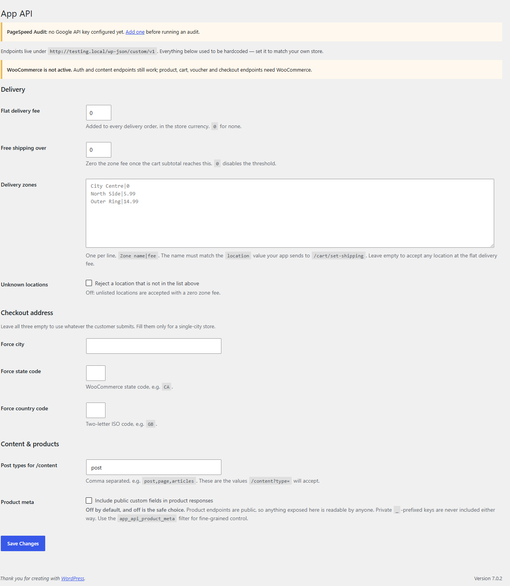

# App Auth & Commerce API

> Drop this into any WordPress + WooCommerce site and it exposes a complete REST API for a mobile app — registration, login, password reset, products, categories, blog content, cart, vouchers and checkout.

**Version:** 1.1.0
**Author:** Noman Nadeem
**Requires:** WordPress 5.7+, PHP 7.0+, WooCommerce 3.5+ (for everything except auth and content)
**License:** GPL-2.0-or-later
**Dependencies:** none — a single PHP file, no Composer, no build step

---

## Screenshot

**Settings → App API.** Delivery fee, free-shipping threshold, the zone table, the checkout address policy and which post types `/content` will serve — all of it used to be hardcoded.



The 20 routes registered by the plugin, live on a test install:

```
/custom/v1/register            /custom/v1/cart/add          /custom/v1/checkout
/custom/v1/login               /custom/v1/cart              /custom/v1/payment-gateways
/custom/v1/forgot-password     /custom/v1/cart/update       /custom/v1/voucher
/custom/v1/products            /custom/v1/cart/remove       /custom/v1/voucher/apply
/custom/v1/products/{category} /custom/v1/cart/clear        /custom/v1/voucher/remove
/custom/v1/product-categories  /custom/v1/cart/set-address
/custom/v1/content             /custom/v1/cart/set-shipping
```

---

## What changed in 1.1.0

The original version was hardwired to one Dubai store: a 50-entry list of Dubai neighbourhoods, a fixed delivery fee, a fixed free-shipping threshold, and every order forced to `Dubai / DU / AE` no matter what the customer entered. This release moves all of that into **Settings → App API**, so the same plugin works on any store in any country.

Also fixed in this release:

- **Product responses no longer dump raw post meta.** The old build returned every `post_meta` key on a public endpoint — including private `_`-prefixed keys like cost price, download URLs and third-party plugin data. That is now off by default, private keys are never returned, and there is a filter for fine-grained control.
- Registration assigns the role from `APP_REGISTER_DEFAULT_ROLE` (it used to ignore the constant and hardcode `customer`), and falls back to `subscriber` if that role does not exist — so registration works on a plain WordPress install without WooCommerce.
- The phone number is stored as `billing_phone` as well as `phone`, so WooCommerce and themes can actually see it.
- `/register` and token lookups report the user's **real** role instead of the literal string `customer`.
- `billing_dubai_location` became `billing_location` (the old parameter name is still accepted).
- Two stray bytes of whitespace before `<?php` were removed — they caused "headers already sent" warnings on every request.

---

## Installation

1. Copy the `app-auth-api` folder into `wp-content/plugins/` and activate it.
2. Go to **Settings → App API** and configure delivery (below).
3. Serve the site over HTTPS. `/login`, `/forgot-password`, `/cart/add` and `/checkout` refuse to run otherwise.

If the site sits behind a proxy or CDN that terminates TLS, add this to `wp-config.php` *above* `require_once ABSPATH . 'wp-settings.php'`, or `is_ssl()` will return false and logins will be rejected:

```php
if ( isset($_SERVER['HTTP_X_FORWARDED_PROTO']) && $_SERVER['HTTP_X_FORWARDED_PROTO'] === 'https' ) {
    $_SERVER['HTTPS'] = 'on';
}
```

`define('APP_AUTH_ALLOW_INSECURE', true);` disables the HTTPS requirement — for local development only.

---

## Settings → App API

| Setting | Default | What it does |
|---|---|---|
| Flat delivery fee | `0` | Added to every delivery order, in the store currency |
| Free shipping over | `0` | Zeroes the zone fee once the cart subtotal reaches this. `0` disables it |
| Delivery zones | empty | One `Zone name\|fee` per line. The name must match the `location` your app sends to `/cart/set-shipping` |
| Reject unknown locations | off | On: a location missing from the list returns `unsupported_location`. Off: it is accepted at a zero zone fee |
| Force city / state / country | empty | Leave empty to use whatever the customer submits. Fill only for a single-city store |
| Post types for /content | `post` | Comma separated. These are the values `/content?type=` will accept |
| Include public custom fields | off | Adds non-private product meta to product responses. **Leave off unless you need it** — product endpoints are public |

Example zone list:

```
City Centre|0
North Side|5.99
Outer Ring|14.99
```

**Constants** (optional, `wp-config.php`): `APP_REGISTER_DEFAULT_ROLE` sets the role new registrations get (default `customer`), and `APP_AUTH_ALLOW_INSECURE` disables the HTTPS check.

---

## The API

Base URL: `https://yoursite.com/wp-json/custom/v1`

Every route is registered with `permission_callback => '__return_true'`; where authentication is needed it is checked inside the handler using a bearer token. Errors come back as:

```json
{ "code": "invalid_login", "message": "…", "data": { "status": 401 } }
```

### Authentication

| Route | Method | Auth | Purpose |
|---|---|---|---|
| `/register` | POST, GET | — | Create an account, or look a user up by token |
| `/login` | POST | — | Exchange credentials for a token |
| `/forgot-password` | POST | — | Send the standard WordPress reset email |

**`POST /register`** — `username`, `email`, `password` (all required), plus optional `first_name`, `last_name`, `phone`.
Returns `201` with `{id, username, email, first_name, last_name, phone, role, token}`.
If `username` is taken it is silently suffixed (`john` → `john_a4Zq`), so **read the returned `username`**.
Errors: `missing_fields` 400 · `invalid_username` 400 · `invalid_email` 400 · `weak_password` 400 · `email_exists` 409 · `create_failed` 400.

Passing `user_token` instead performs a **token lookup** — no account is created, and the matching user's profile comes back (`invalid_token` 404 if there is no match).

**`POST /login`** — `username` (accepts a username *or* an email) and `password`.
Returns `200` with `{user_id, username, email, role, token}`.
Errors: `insecure_connection` 403 · `rate_limited` 429 · `invalid_login` 401.
Rate limit: 1 attempt per IP per 30 seconds.

**`POST /forgot-password`** — `email`. Always returns `{sent: true}` whether or not the account exists, so it cannot be used to enumerate users. Rate limit: 1 per IP per 60 seconds.
The reset itself completes on the standard `wp-login.php` page in the email — there is no API endpoint to submit a new password, so a mobile app must open a web view.

**Using the token.** Send it as `Authorization: Bearer <token>`, or as a `token` query/body parameter.

```
Authorization: Bearer 8fK2p…
```

The token is 64 characters, stored in the `_app_auth_token` user meta. It **never expires**, there is **one per user** (logging in on a second device invalidates the first), and there is **no logout endpoint** — the only way to invalidate one is another login.

### Catalogue — needs WooCommerce

| Route | Method | Auth | Purpose |
|---|---|---|---|
| `/products` | GET | — | Featured, on-sale and recently-reviewed products, 5 each |
| `/products/{category}` | GET | — | Paginated products in one category |
| `/product-categories` | GET | — | The category tree with images |

**`GET /products`** — no arguments. Returns `{featured: [...], special: [...], reviewed: [...]}`, five products per bucket.

- **featured** = WooCommerce's own Featured flag (the star in the Products list).
- **special** = products currently on sale (`wc_get_product_ids_on_sale()`).
- **reviewed** = the five products with the most recent approved reviews. *Note:* this reads `comment_type = 'review'`, which only exists on reviews created by WooCommerce 3.5+ — on sites with older or imported reviews this bucket can come back empty.

**`GET /products/{category}`** — the path segment accepts a **term ID, a slug, or the category name**.

| Arg | Default | Notes |
|---|---|---|
| `limit` | 50 | No maximum is enforced — keep it sane |
| `page` | 1 | |
| `include_children` | true | Include products in sub-categories |

Returns `{category: {id, slug, name, sub_categories}, meta: {page, per_page, total, has_more, children_included, matched_term_ids}, products: [...]}`.
Errors: `woocommerce_inactive` 503 · `invalid_category` 404.

**`GET /product-categories`** — `parent` (default 0), `depth` (0 = unlimited), `hide_empty` (accepted but currently ignored; empty categories are always returned). Returns a nested tree of `{id, name, image, sub_categories}`.

**The product object** returned by both product endpoints:

```json
{
  "id": 123, "name": "…", "slug": "…", "sku": "…", "type": "simple", "status": "publish",
  "permalink": "https://…",
  "price": "99.00", "regular_price": "120.00", "sale_price": "99.00",
  "price_html": "…", "on_sale": true,
  "stock_status": "instock", "stock_quantity": null, "manage_stock": false,
  "short_description": "…", "description": "…",
  "images": [{ "id": 55, "src": "https://…" }],
  "categories": [{ "id": 15, "name": "Wine", "slug": "wine" }],
  "tags": [{ "id": 22, "name": "Red", "slug": "red" }],
  "attributes": [{ "name": "Size", "slug": "pa_size", "values": [...], "visible": true, "variation": true }],
  "variations": [{ "id": 124, "sku": "…", "price": "…", "image": "…", "attributes": [...], "permalink": "…" }],
  "average_rating": "4.50", "rating_count": 12, "review_count": 12,
  "sub_categories": [{ "id": 16, "name": "Red", "slug": "red", "parent": 15 }],
  "post_meta": {}
}
```

`post_meta` is empty unless you enable it in settings, and private `_`-prefixed keys are never included. To expose a specific field:

```php
add_filter( 'app_api_product_meta', function ( $meta, $product_id ) {
    $meta['vintage'] = get_post_meta( $product_id, 'vintage', true );
    return $meta;
}, 10, 2 );
```

### Content — no WooCommerce needed

**`GET /content`**

| Arg | Required | Default | Notes |
|---|---|---|---|
| `type` | yes | — | Must be one of the post types configured in settings |
| `limit` | no | 10 | Capped at 50 |
| `page` | no | 1 | |
| `search` | no | — | Matches title and content |

Returns `{type, total, page, per_page, has_more, items: [{id, title, excerpt, content, date_gmt, author, featured_img, permalink}]}`.

### Cart — needs WooCommerce and a token

| Route | Method | Body | Returns |
|---|---|---|---|
| `/cart` | GET | — | The cart snapshot |
| `/cart/add` | POST | `product_id`, `variation_id`, `quantity`, `attributes` | `{added, cart_item_key, cart}` |
| `/cart/update` | POST | `cart_item_key`, `quantity` (0 removes) | `{updated, cart}` |
| `/cart/remove` | POST | `cart_item_key` | `{removed, cart}` |
| `/cart/clear` | POST | — | `{cleared, cart}` |
| `/cart/set-address` | POST | `country` (required), `state`, `city`, `postcode`, `address1`, `address2` | `{ok, cart}` |
| `/cart/set-shipping` | POST | `shipping_method` (`pickup` or anything else = delivery), `location` | `{success, shipping_method, location, delivery_fee, shipping_fee, cart}` |

> `/cart/add` **sets** the quantity rather than incrementing it — adding the same line twice replaces it.

> `/cart/set-shipping` must be called before `/checkout`, otherwise both fees default to `0` and shipping is free.

**The cart snapshot:**

```json
{
  "items": [{ "cart_item_key": "…", "product_id": 123, "variation_id": 0, "name": "…", "sku": "…",
              "quantity": 2, "price": 99.0, "price_html": "…", "subtotal": "…", "image": "…",
              "attributes": {...}, "permalink": "…" }],
  "item_count": 2, "subtotal": 198.0,
  "delivery_fee": 7.45, "shipping_fee": 0, "total": 205.45,
  "currency": "AED", "shipping_method": "delivery", "location": "City Centre"
}
```

### Vouchers — needs WooCommerce and a token

| Route | Method | Args | Returns |
|---|---|---|---|
| `/voucher` | GET | — | `{ok, coupons, cart}` |
| `/voucher/apply` | GET | `code` | `{applied, code, cart}` |
| `/voucher/remove` | GET | `code` | `{removed, code, cart}` |

> These are `GET` requests that change state — a legacy quirk of the original API. Treat them as mutations and do not let a CDN cache them.

### Checkout — needs WooCommerce and a token

**`POST /checkout`**

| Arg | Required | Notes |
|---|---|---|
| `billing_first_name` | yes | |
| `billing_last_name` | yes | |
| `billing_address_1` | yes | |
| `billing_address_2` | no | |
| `billing_city` | no | Used unless a "force city" is set in settings |
| `billing_location` | no | Free-text area/zone, stored as order meta. `billing_dubai_location` still accepted |
| `billing_phone` | yes | |
| `billing_email` | yes | |
| `payment_method` | yes | A gateway id — get them from `/payment-gateways` |
| `order_notes` | no | Added as a private admin note |

Returns `201` with `{success, order_id, order_key, status, subtotal, delivery_fee, shipping_fee, total, currency, payment_url}`.
`payment_url` is omitted when `payment_method` is `cod`.
Errors: `woocommerce_inactive` 503 · `insecure_connection` 403 · `unauthorized` 401 · `empty_cart` 400 · `invalid_payment` 400.

**`GET /payment-gateways`** — no auth. Returns `{gateway_id: "Title"}` for every registered gateway.

---

## Known limitations

These are behaviours of the original implementation that were left intact because changing them would break the mobile app it was written for. **Read this list before putting the checkout live.**

- **Orders are created as guest orders** (`customer_id = 0`), so they do not appear in the customer's My Account order history.
- **Coupon discounts are dropped at checkout.** Vouchers applied to the cart do not carry over to the order, so the customer is charged full price. Fix this before selling with coupons.
- **Checkout does not take payment.** The order is created with status `pending`, stock is not reduced, no gateway `process_payment()` runs, and no WooCommerce order emails are sent. `payment_url` is where the customer actually pays.
- Delivery and shipping are added as **fee line items**, not shipping lines, so they are reported as fees.
- `/checkout` accepts **disabled** gateways.
- `order_notes` becomes a private admin note, not the customer note.
- Per-item `subtotal` in the cart snapshot is unreliable for currencies whose symbol precedes the amount.
- Tokens never expire, there is one per user, and there is no logout endpoint.
- `/register` is not rate-limited — anyone can create accounts and trigger welcome emails in a loop. Put a captcha or a WAF rule in front of it on a public app.
- No single-product endpoint, no search, no order history, no profile update, no address book.
- Cart state is persisted as serialised objects in user meta, which bloats the database and does not survive product class changes cleanly.
- `/products/{category}` loads every product in the category just to count them — slow on large catalogues.
- No i18n; all messages are hard-coded English.

---

## Requirements

| Item | Requirement |
|---|---|
| WordPress | 5.7+ (`retrieve_password()` moved into core in 5.7) |
| PHP | 7.0+ |
| WooCommerce | 3.5+ for catalogue, cart, voucher and checkout endpoints |
| HTTPS | Required by `/login`, `/forgot-password`, `/cart/add` and `/checkout` |
| Permalinks | Anything but "Plain", or use `?rest_route=` |
| Email | A working `wp_mail` for registration and reset emails — use an SMTP plugin |

Without WooCommerce, `/register`, `/login`, `/forgot-password` and `/content` still work; catalogue and commerce endpoints return `woocommerce_inactive` 503.

---

## Developer hooks

```php
// Adjust the delivery zone table at runtime
add_filter( 'app_api_shipping_zones', function ( $zones ) {
    $zones['Airport'] = 25.00;
    return $zones;
} );

// Choose exactly which product meta is public
add_filter( 'app_api_product_meta', function ( $meta, $product_id ) {
    return [ 'vintage' => get_post_meta( $product_id, 'vintage', true ) ];
}, 10, 2 );
```
