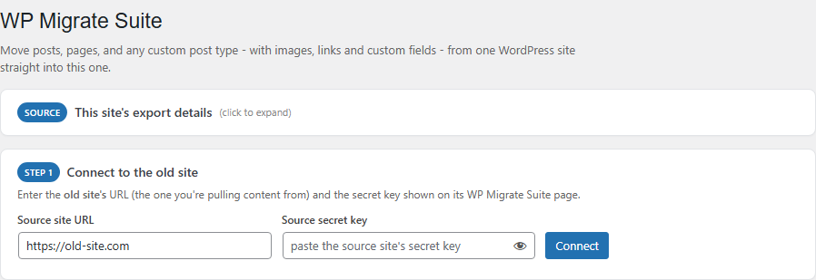
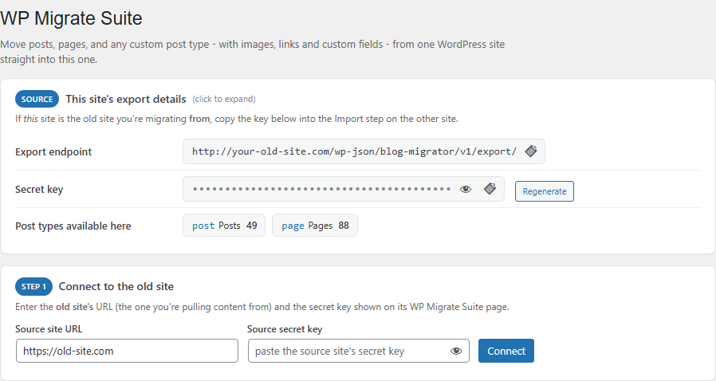
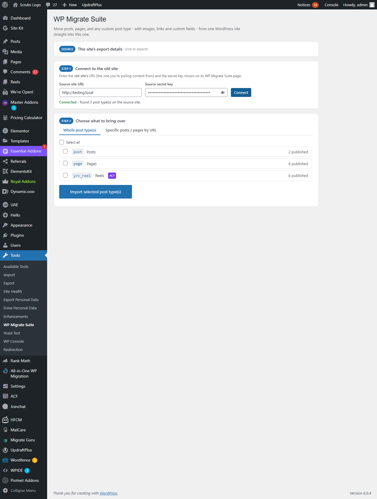
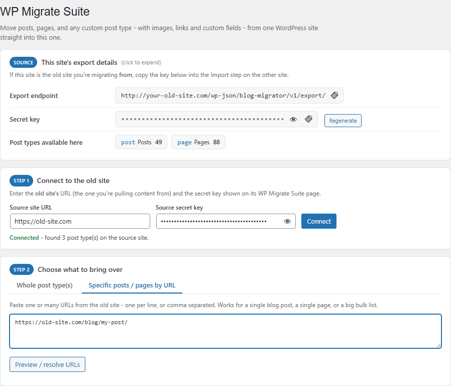
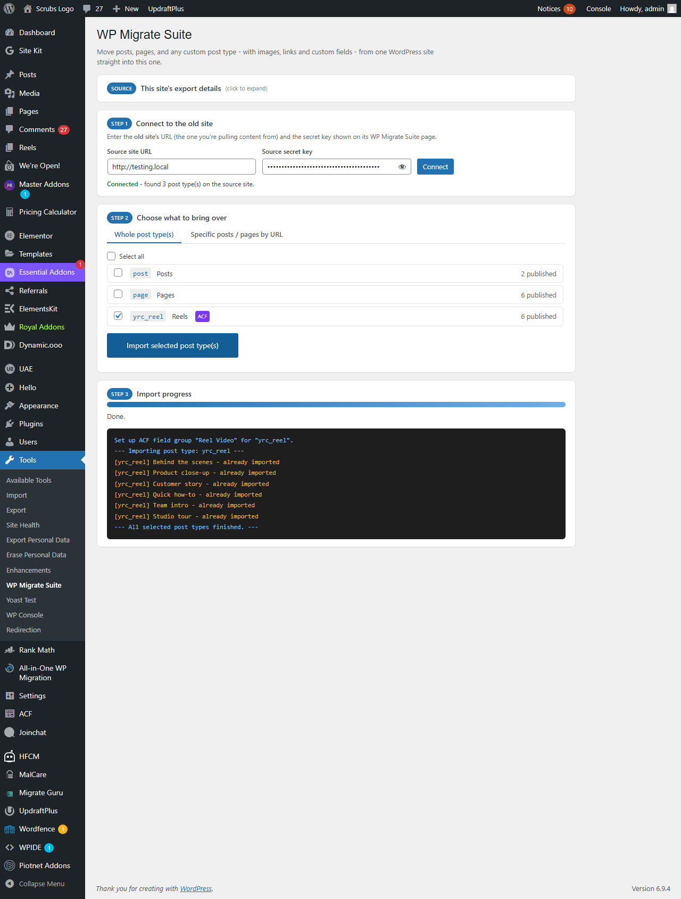

# WP Migrate Suite

> Move posts, pages, or any custom post type — with images, internal links, taxonomies and ACF custom fields — from one WordPress site straight into another. Pick a whole post type, or paste a handful of URLs and migrate just those.

**Version:** 2.2.0
**Author:** Noman Nadeem
**Requires:** WordPress 5.0+, PHP 7.4+
**License:** GPL-2.0-or-later
**Dependencies:** none required. [Advanced Custom Fields](https://www.advancedcustomfields.com/) is auto-detected and used if present.

---

## Screenshots

**The plugin page.** Install it on both sites. The card at the top shows this site's own export details (collapsed by default — expand it only if this site is the one you're migrating *from*).

**Export details, expanded.** The REST endpoint and secret key this site exposes, plus every post type it can export, with live published counts and an ACF badge where relevant.

**Connected to a source site.** After entering the old site's URL and secret key, every public post type on that site is listed with its count — tick the ones you want and import.

**Or migrate specific posts/pages.** Paste one URL or a big list, resolve them against the source site, and import exactly those — no need to pull an entire post type for one page.

**Live import log.** Progress bar, per-post status (imported / skipped / error), and — when the post type uses ACF — a line confirming the matching field group was set up automatically on this site.

---

## What it does

Install the same plugin on both the **old (source)** site and the **new (target)** site. On the target site's WP Migrate Suite page, enter the source site's URL and secret key, then either:

- **Whole post type(s)** — tick `post`, `page`, or any custom post type and import everything published in it, or
- **Specific posts/pages by URL** — paste URLs (one per line or comma separated) from the source site; the plugin resolves each to its post and imports just those.

For every post migrated:

- **Content & meta** — title, slug, content, excerpt, status, date and every custom field (postmeta) are copied, including SEO plugin fields (RankMath, Yoast, etc.) since those are just postmeta too.
- **Every taxonomy is migrated, not just categories/tags.** Whatever taxonomies are registered for the post type — including custom ones like a "Portfolio Type" or "Reel Category" — are exported term-by-term, with each term's parent tracked so hierarchical taxonomies (nested categories, etc.) rebuild with the same structure on the target.
- **Images are actually downloaded**, not just linked. The featured image and every `` found in the content (and inside meta values such as Elementor's `_elementor_data`) are fetched from the source site and sideloaded into this site's own Media Library — so the new site doesn't depend on the old one staying online.
- **Internal links get re-pointed.** Any other reference to the source domain (anchor `<a href>`, canonical URLs, etc.) has its host swapped for this site's, keeping the same path.
- **ACF fields survive intact.** Image/file/gallery fields, and nested repeater/flexible-content/group fields, are walked recursively so their images get sideloaded too, not left as broken references to the old site.
- **Missing post types and missing taxonomies are both auto-registered** on the target site (with a menu / admin column, so imported content is actually visible), and **the matching ACF field group is recreated automatically** if ACF is active on the target — using ACF's own import mechanism, so fields display and edit exactly as they did on the source.
- If a post type needs ACF and ACF isn't installed on the target at all, the import is refused up front with a clear message, rather than silently importing data nobody can see or edit properly.
- Safe to re-run: each imported post is tagged with its source ID, so running the same import again skips anything already brought over instead of duplicating it.

---

## Installation

Copy the `blog-content-migrator` folder into `wp-content/plugins/` on **both** the old and the new site, and activate it on both. No configuration needed — a secret key is generated automatically on activation.

---

## Usage

1. **On the old site:** open **Tools → WP Migrate Suite**, expand *"This site's export details"*, and copy the secret key.
2. **On the new site:** open **Tools → WP Migrate Suite** → **Step 1**, paste the old site's URL and the key you copied, and click **Connect**.
3. **Step 2** — either:
   - tick the post type(s) you want under **Whole post type(s)** and click **Import selected post type(s)**, or
   - switch to **Specific posts / pages by URL**, paste URLs, click **Preview / resolve URLs** to confirm what was found, then **Import resolved posts**.
4. Watch **Step 3** for a live progress bar and per-item log. If a post type needs a plugin (like ACF) that isn't active on this site, you'll be told before anything runs.

---

## Using it on a different website

| Concern | Behaviour |
|---|---|
| Local/dev domains (`.local`, `.test`) | Supported. Image downloads deliberately bypass WordPress's default SSRF protection (`wp_safe_remote_get`) for this one authenticated, admin-initiated transfer — appropriate here since the "remote" host is a site the admin explicitly typed in and unlocked with a secret key |
| Same site as source and target | Blocked, both in the UI and server-side — refuses to import a site into itself |
| Re-running an import | Safe — posts already imported (tracked via a source-ID meta key) are skipped, not duplicated |
| A post type that doesn't exist on the target | Auto-registered generically (title/editor/thumbnail/custom-fields, shown in the admin menu) so imported content is visible immediately |
| A taxonomy that doesn't exist on the target | Auto-registered generically (hierarchical if it was on the source, shown as an admin column) and attached to the imported post type |
| ACF field groups | Recreated automatically via ACF's own `acf_import_field_group()` when ACF is active on the target; import is blocked with a clear message if a post type needs ACF and it isn't installed there |
| Large libraries | Export and import both run in small paged batches (5 posts per request) to avoid timeouts; images are cached per-request so a file referenced many times is only downloaded once |
| Multisite | Untested as a network plugin; expected to work per-site |

---

## Technical reference

**Auth** — a 40-character secret key (`bcm_secret_key` option, regenerable) is required as the `X-Migrator-Key` header on every REST call. There is no other authentication; anyone with the URL and key can read that site's content, so treat the key like a password.

**REST routes** (namespace `blog-migrator/v1`, all require the header above):

| Route | Purpose |
|---|---|
| `GET /export` | Paged post export. Params: `post_type`, `page`, `per_page`, or `include` (comma-separated IDs to fetch specific posts regardless of paging) |
| `GET /post-types` | Public post types on this site with published counts and an ACF-usage flag |
| `GET\|POST /resolve-urls` | Resolves a list of URLs to post ID + post type via `url_to_postid()` |
| `GET /acf-field-groups` | ACF field group definition(s) for a post type, in the shape ACF's own import tool expects |

Each exported post carries a `taxonomies` object keyed by taxonomy slug — label, whether it's hierarchical, and its terms (name, slug, parent slug) — built by `bcm_export_post_taxonomies()`.

**Storage** — imported posts get two meta keys: `_bcm_source_id` (the post's ID on the source site, used for the re-run skip check) and `_bcm_source_url` (its original permalink). Auto-registered post types are persisted in `bcm_dynamic_post_types` and auto-registered taxonomies in `bcm_dynamic_taxonomies`; both are re-registered on every `init`.

**Import flow** — `wp_ajax_bcm_prepare_import` runs first (registers missing post types, imports ACF field groups, or blocks with `acf_required`), then `wp_ajax_bcm_run_import_batch` proxies the source's `/export` endpoint and calls `wp_insert_post()` per item. Images are fetched with a custom `bcm_download_url()` (uses `wp_remote_get()`, not `download_url()`) specifically to avoid the local-network block described above, then handed to `media_handle_sideload()`.

---

## Known limitations

- **Author/user mapping** is not migrated — imported posts have no author set by `wp_insert_post()`'s defaults; assign one if needed.
- **ACF relationship/post-object fields** pointing at other posts are copied as raw IDs from the source site, which won't resolve to anything meaningful on the target unless those exact IDs happen to also exist there.
- **No content-side rewriting for OG/Twitter meta image URLs** beyond the same domain-swap and uploads-path handling applied to all other meta.
- **No UI for re-mapping taxonomy terms** to existing target-site terms — matching is automatic by slug, with terms created if no match is found; there's no manual override.
- **Term parent chains only go one level deep from the exported data** — a term's direct parent is recreated, but a grandparent that was never itself assigned to an exported post won't be, so a 3+ level hierarchy can flatten by one step in an edge case.
- No i18n; all strings are hard-coded English.
