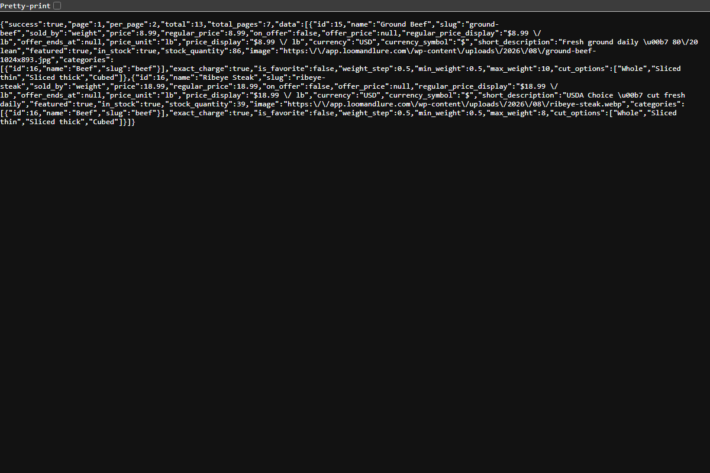

# Casa Prime Core

**A complete headless e-commerce engine for WordPress + WooCommerce** — built for the Casa Prime premium meat shop platform. It turns a standard WooCommerce store into a full backend for mobile apps: JWT authentication, server-side cart, weight-based pricing, distance-based delivery, rider management, Stripe payments and Firebase push notifications — all through a clean REST API.

> **Author:** Noman Nadeem ([dev-noman501](https://github.com/dev-noman501))
> **Requires:** WordPress 6.0+, PHP 7.4+, WooCommerce (active)
> **Version:** 0.1.0

---

## 📸 Screenshots

The live storefront powered by this plugin (WooCommerce + Elementor):

| Storefront Home | Shop Page |
|---|---|
|  |  |

The REST API in action (`GET /wp-json/casa-prime/v1/products`):



---

## ✨ Features

### 🔐 Authentication & Users
- **Self-contained JWT (HS256) auth** — no external JWT plugin/library. Tokens carry a per-user *token version*, so "logout from all devices" and password changes instantly invalidate old tokens.
- Register / login (by email **or** phone), profile endpoint, Firebase phone-verification flag.
- **Password reset by 6-digit email code** (15-minute expiry, one-time use) + change-password.
- **Custom roles**: `customer`, `rider`, `manager` — each with granular capabilities; admin gets everything.
- **Login As User** — admin-only magic login links (hashed tokens, 12h expiry) to experience the site as any customer/rider/manager. Great for testing role flows.

### 🛒 Cart, Pricing & Coupons
- **Server-side cart** stored per user — the client *never* sends a price; everything is computed on the server.
- **Weight-based pricing (exact charge)**: `total = weight × per-lb price`, validated against each product's `weight_step` / `min_weight` / `max_weight`. Also supports per-each products.
- Cut preferences + special instructions per line item; identical lines auto-merge.
- **Full WooCommerce coupon support** through the API — expiry, usage limits, per-user limits, min/max spend, product/category and sale-item restrictions all validated server-side.

### 🚚 Delivery Engine
- **Distance-based delivery quotes**: customer location + cart subtotal → fee. Pluggable distance providers — free Haversine radius, or Google Distance Matrix (driving distance) with automatic fallback.
- **Admin-editable distance tiers** (Casa Prime → Delivery Settings): flat fees, tiered fees, free-delivery threshold, max range — client can change pricing with zero code changes.
- **Delivery dates** — "Today" or scheduled upcoming days; the booking window is admin-configurable.
- Ships as a real **WooCommerce shipping method** too, so the website checkout uses the exact same fee engine as the app (with address geocoding via Google or OpenStreetMap).
- Delivery vs **Store Pickup** fulfillment on every order; pickup orders skip the rider leg.

### 📦 Order Lifecycle
- **Custom WooCommerce order statuses** modelling the real store flow:
  `processing` (Placed) → `preparing` (Accepted) → `ready` → `out-for-delivery` → `delivered`, with side exits for `rejected`, `cancelled` and `failed-delivery` — all transitions validated against a status map.
- **Order Queue** — a card-based fulfillment screen in wp-admin showing exactly what to pack (weights, cuts, customer notes, address) with Accept → Prepare → Ready actions.
- **Casa Prime Panel** — a self-contained, role-based front-end dashboard (`/?cpc_panel=1`): customers see orders/tracking, riders see deliveries, managers run the whole flow and assign riders. No theme, no wp-admin needed.

### 🏍️ Rider Management
- Rider app API: availability toggle, live location ping, pickup/deliver tabs, "I've arrived" (pushes to customer), COD cash collection, **proof of delivery** (photo or signature), failed-delivery with reason, delivery history.
- **Earnings & COD reconciliation** — riders keep tips, hand full COD cash to the store; earnings are computed live from delivered orders (never stored twice, can't drift). Managers see every rider's balance and record cash settlements.
- Manager endpoints: rider roster with live locations and active loads, per-rider balances, settle-up.

### 💳 Payments (Stripe)
- **Exact-charge card flow** via Stripe PaymentIntents — direct REST integration (`wp_remote_*`), no SDK, keys live only in `wp-config.php`.
- App flow: checkout → `create-payment-intent` → PaymentSheet on device → server **verifies with Stripe** (status + amount) before marking paid.
- **Signature-verified webhook** so orders get paid even if the app crashes mid-payment.
- Automatic **full refunds** for prepaid orders cancelled after failed delivery.
- Cash on Delivery supported side-by-side.

### 🔔 Push Notifications (Firebase)
- **FCM HTTP v1 integration** — OAuth2 via the Firebase service account, no SDK. Multi-device tokens per user with auto-dedup.
- Pushes on: order confirmed, rider arrived, out for delivery, delivered (customer); new order assigned, redelivery assigned (rider).

### ⚙️ Store Management
- **Today's Special** — one-at-a-time promo banner flagged directly on a product (like WooCommerce's "Featured" star); auto-deactivates on expiry, out-of-stock or unpublish.
- **Store Contact** settings (phone / WhatsApp / email / hours) exposed on a public endpoint for the app's Help screen.
- **SMTP email settings** (admin page or `wp-config.php` constants) so password-reset codes and order emails actually deliver.
- Checkout **rider-tip selector** on the web checkout matching the app's tip flow.
- WooCommerce **HPOS-compatible**.

---

## 🔌 REST API

Namespace: **`/wp-json/casa-prime/v1`** — 60+ endpoints covering auth, products, cart, checkout, orders, tracking, addresses, favorites, delivery quotes, riders, managers and device tokens.

📖 **Full endpoint reference with request/response bodies: [API-REFERENCE.md](API-REFERENCE.md)**

Quick taste:

```http
POST /wp-json/casa-prime/v1/auth/login
{ "login": "customer@example.com", "password": "secret" }
→ { "success": true, "token": "eyJ...", "user": { ... } }
```

```http
GET  /wp-json/casa-prime/v1/delivery/quote?lat=40.71&lng=-74.00&subtotal=45
→ { "deliverable": true, "fee": 0, "distance": 3.2 }
```

```http
POST /wp-json/casa-prime/v1/cart/items          (Authorization: Bearer <JWT>)
{ "product_id": 123, "amount": 2.5, "cut": "Thin sliced" }
```

---

## 🚀 Installation

1. Install and activate **WooCommerce**.
2. Copy the `casa-prime-core` folder into `wp-content/plugins/`.
3. Activate **Casa Prime Core** — roles and capabilities are created on activation.
4. Configure under the **Casa Prime** admin menu: Delivery Settings, Store Contact, Email SMTP.

### wp-config.php constants

```php
// REQUIRED in production — JWT signing secret (falls back to auth salt in dev)
define( 'CPC_JWT_SECRET', 'a-long-random-string' );

// Stripe (optional — card payments switch on automatically when present)
define( 'CPC_STRIPE_SECRET_KEY',      'sk_live_...' );
define( 'CPC_STRIPE_PUBLISHABLE_KEY', 'pk_live_...' );
define( 'CPC_STRIPE_WEBHOOK_SECRET',  'whsec_...' );

// SMTP (optional — can also be set from the admin page)
define( 'CPC_SMTP_HOST', 'smtp.example.com' );
define( 'CPC_SMTP_PORT', 587 );
define( 'CPC_SMTP_USER', '...' );
define( 'CPC_SMTP_PASS', '...' );

// Firebase push (optional) — path to the service-account key file
define( 'CPC_FCM_KEY_FILE', __DIR__ . '/wp-content/cpc-fcm-key.php' );
```

> 🔒 **No secrets ever live in the database or this repo** — keys are read from `wp-config.php` only.

---

## ♻️ Reusing this plugin in another project

The plugin is intentionally modular — every feature is one class in `includes/`, booted from `casa-prime-core.php`. To use it as the backend for a different store app:

1. **Take the whole plugin** and rename the folder/text-domain if you want your own branding (`casa-prime-core` → `your-store-core`, prefix `CPC_`/`cpc_` → yours).
2. **Keep what you need, comment out what you don't** — each feature is a single `require_once` + `::init()` pair in the main file. Don't need riders? Drop `CPC_REST_Rider` + `CPC_Earnings`. No push? Drop `CPC_FCM` + `CPC_REST_Device_Token`.
3. **Weight-based pricing is optional** — regular "per each" products work out of the box; weight fields only activate when a product defines them.
4. **Delivery tiers are data, not code** — model flat fees, tiered fees, any free radius or max range from the admin page.
5. Point your mobile app at `https://your-site.com/wp-json/casa-prime/v1` and follow [API-REFERENCE.md](API-REFERENCE.md).

Zero external PHP dependencies (no composer, no SDKs) — JWT, Stripe and FCM are all implemented directly against their HTTP APIs, so the plugin drops into any standard WordPress host.

---

## 🗂️ Project structure

```
casa-prime-core/
├── casa-prime-core.php          # bootstrap: loads + inits every module
├── API-REFERENCE.md             # full REST API documentation
├── uninstall.php
├── includes/
│   ├── class-cpc-roles.php            # custom roles & capabilities
│   ├── class-cpc-jwt.php              # self-contained HS256 JWT auth
│   ├── class-cpc-cart.php             # server-side cart (exact-charge pricing)
│   ├── class-cpc-coupons.php          # WooCommerce coupons for the app cart
│   ├── class-cpc-order-statuses.php   # custom order lifecycle + transition map
│   ├── class-cpc-order-queue.php      # wp-admin fulfillment card screen
│   ├── class-cpc-panel.php            # role-based front-end dashboard
│   ├── class-cpc-fulfillment.php      # delivery vs pickup handling
│   ├── class-cpc-delivery-engine.php  # distance → fee quotes (Haversine/Google)
│   ├── class-cpc-delivery-settings.php# admin-editable tiers & thresholds
│   ├── class-cpc-delivery-date.php    # today / scheduled delivery days
│   ├── class-cpc-shipping-method.php  # Woo shipping method on the same engine
│   ├── class-cpc-stripe.php           # PaymentIntents + webhook + refunds
│   ├── class-cpc-fcm.php              # Firebase push (HTTP v1, OAuth2)
│   ├── class-cpc-earnings.php         # rider earnings & COD reconciliation
│   ├── class-cpc-email.php            # SMTP configuration
│   ├── class-cpc-special-offer.php    # "Today's Special" promo banner
│   ├── class-cpc-store-contact.php    # store contact details endpoint
│   ├── class-cpc-checkout-tip.php     # rider tip on web checkout
│   ├── class-cpc-login-as.php         # admin magic-login testing tool
│   └── api/                           # REST controllers (one per domain)
│       ├── class-cpc-rest-auth.php        ├── class-cpc-rest-products.php
│       ├── class-cpc-rest-password.php    ├── class-cpc-rest-cart.php
│       ├── class-cpc-rest-address.php     ├── class-cpc-rest-checkout.php
│       ├── class-cpc-rest-delivery.php    ├── class-cpc-rest-rider.php
│       ├── class-cpc-rest-tracking.php    ├── class-cpc-rest-favorites.php
│       ├── class-cpc-rest-special-offer.php
│       └── class-cpc-rest-device-token.php
└── docs/screenshots/
```

---

## 📄 License

Proprietary — built by **Noman Nadeem** for the Casa Prime project. Contact before reuse.
