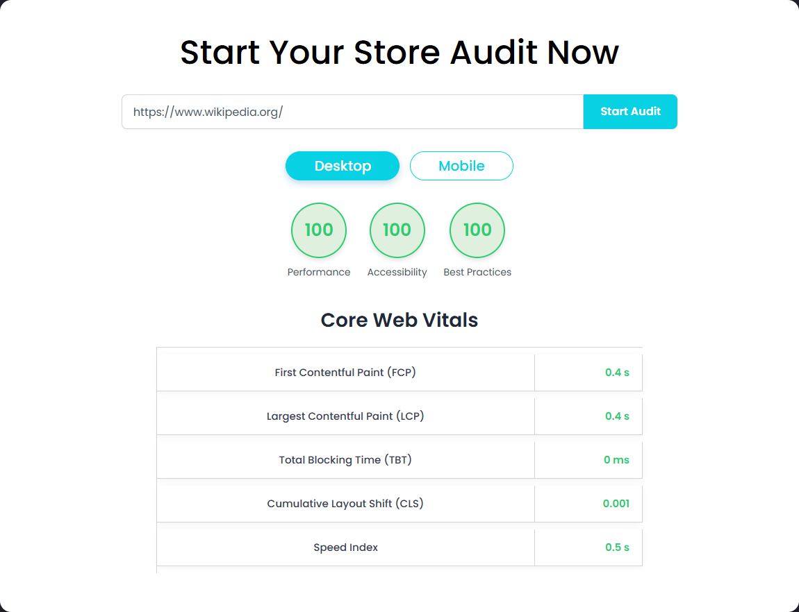
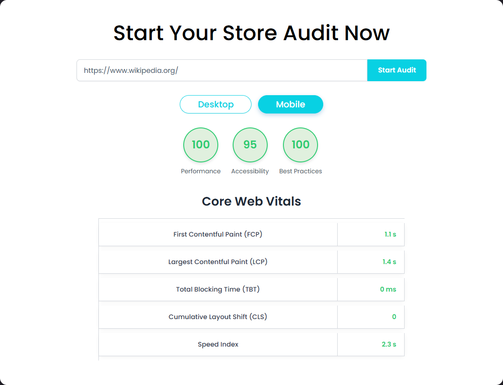
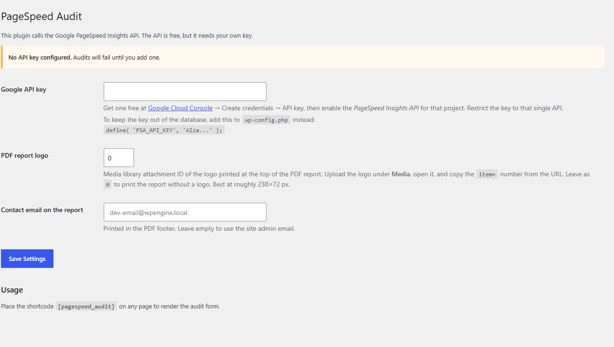
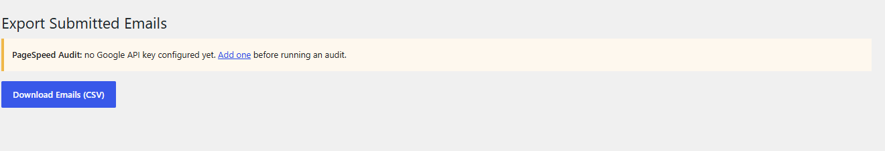

# PageSpeed Audit Plugin

> A front-end "audit my site" tool. A visitor enters a URL, the plugin runs it through the Google PageSpeed Insights API for both desktop and mobile, shows the four Lighthouse scores plus Core Web Vitals, and emails them a PDF report.

**Version:** 1.7
**Author:** Noman Nadeem
**Requires:** WordPress 5.0+, PHP 7.1+, `ext-dom`, `ext-mbstring`, `ext-gd`
**Shortcode:** `[pagespeed_audit]`
**Bundles:** [dompdf 2.0.3](https://github.com/dompdf/dompdf) (LGPL) for PDF generation

---

## Screenshots

A visitor enters a URL and gets real Lighthouse scores and Core Web Vitals, with Desktop and Mobile tabs. Both come from a single request — the plugin fetches the two strategies together, so switching tabs is instant.

| Desktop | Mobile |
|---|---|
|  |  |

The colours, logo and copy all come from the site the plugin is installed on — nothing about the look is baked into the plugin.

**Settings → PageSpeed Audit** — the API key, the PDF logo and the contact email printed on the report.



Captured addresses are exported from **PageSpeed Emails**.



---

## What changed in this release

- **The Google API key is no longer hardcoded.** The original shipped a live key baked into the source, which meant every copy of the plugin shared one key and anyone with the files could use it. There is now a settings screen, and the key can also be set in `wp-config.php`.
- **Brand assets removed.** The bundled logo, banner image and hardcoded support email in the PDF footer are gone. The report logo and contact email are settings now, so the report carries whoever installs it.
- A stray `report.pdf` development artifact was removed from the package.

---

## How it works

```
Visitor enters a URL
   → email gate (optional lead capture)
   → AJAX to admin-ajax.php
   → 2 calls to Google PageSpeed Insights (desktop, then mobile)
   → 4 score circles + Core Web Vitals table, with Desktop/Mobile tabs
   → PDF generated with dompdf and emailed to the captured address
```

---

## Setup

### 1. Get a Google API key

1. Open the [Google Cloud Console](https://console.cloud.google.com/) and create or pick a project.
2. **APIs & Services → Library** → search **PageSpeed Insights API** → **Enable**.
3. **APIs & Services → Credentials** → **Create credentials → API key**. Copy the `AIza…` string.
4. Restrict it: on the key, **API restrictions → Restrict key → PageSpeed Insights API**.

> Referrer restrictions will **not** work — the call is made server-side, not from the browser. Use an IP restriction with your server's outbound IP, or rely on the API restriction plus a quota cap.

Free quota is 25,000 requests/day and 240/minute. **Each audit uses two** (desktop + mobile).

### 2. Configure the plugin

Install and activate, then go to **Settings → PageSpeed Audit**:

| Setting | Notes |
|---|---|
| Google API key | Required. Audits fail with a clear message until it is set |
| PDF report logo | Media library attachment ID, printed at the top of the report. `0` for no logo. Around 238×72 px works best |
| Contact email on the report | Printed in the PDF footer. Empty uses the site admin email |

To keep the key out of the database and out of version control, put it in `wp-config.php` instead — it overrides the field:

```php
define( 'PSA_API_KEY', 'AIza…' );
```

### 3. Place the shortcode

```
[pagespeed_audit]
```

It takes no attributes. It works inside an Elementor **Shortcode** widget — there is a CSS rule for that.

### 4. Configure mail and timeouts

- Install an SMTP plugin, or the PDF emails will land in spam.
- Each audit makes two sequential API calls with a 200-second timeout each. Make sure PHP `max_execution_time` and your nginx/Apache/PHP-FPM read timeouts allow for it, or slow sites will fail with a gateway error.

---

## What the visitor sees

1. **Email gate** — a modal asking for an email before the form is usable. The address is stored and used to send the PDF.
2. **The audit form** — a URL field and a **Start Audit** button.
3. **Results** — four coloured score circles (Performance, Accessibility, Best Practices, SEO) using Google's own banding: green ≥ 90, amber ≥ 50, red below. Below them a Core Web Vitals table with FCP, LCP, TBT, CLS and Speed Index, each colour-coded against Google's thresholds.
4. **Desktop / Mobile tabs** — both strategies are fetched in one go, so switching is instant.
5. **The PDF** arrives by email: logo, domain, date, the score table and the Core Web Vitals table.

---

## Collecting the leads

**PageSpeed Emails** in the admin sidebar → **Download Emails (CSV)**. Addresses are stored in a `{prefix}psa_emails` table with a timestamp.

> There is no list view in wp-admin — the CSV export is the only way to read them.

---

## Before you put this on a public site

This plugin is a public, unauthenticated tool that spends your API quota and sends email. Read these first.

- **Both AJAX endpoints are public and have no nonce.** Anyone can call them directly with `curl`, skipping the email gate entirely.
- **No rate limiting.** Each request costs two Google API calls, up to ~400 seconds of a PHP worker, a PDF render and an outbound email. A handful of concurrent requests can exhaust your worker pool, and a script can burn the daily quota in minutes. **Put a captcha, a rate limit or a WAF rule in front of it.**
- **The PDF is emailed to whatever address is in the `psa_user_email` cookie.** Someone can set that cookie themselves and use your site to send mail to arbitrary recipients. Watch your domain reputation.
- **The email gate is client-side only** (a localStorage flag) and takes seconds to bypass.
- The generated PDF is written to `wp-content/uploads/` for the duration of the send — briefly readable at a guessable URL.
- No privacy-policy link, consent checkbox or unsubscribe on the email capture, and the table is not removed on uninstall. Add consent language before collecting addresses in the EU/UK/California.

---

## Known limitations

- **Only the desktop numbers go into the PDF**, even though mobile is fetched and shown on screen, and the PDF does not say which strategy it represents.
- **A partial Lighthouse run reports a false zero.** A `null` category score becomes `0` with no indication that the run failed.
- **Metric colouring is locale-fragile.** The thresholds parse Google's display strings, so a comma-decimal locale (`"1,2 s"`) or a value returned in milliseconds where seconds are expected will be mis-coloured. Requesting `&locale=en` or reading `numericValue` would fix it.
- No caching — re-auditing the same URL always spends two more API calls.
- The two API calls run sequentially, so a slow audit can take several minutes.
- The results show scores only. Opportunities, diagnostics, field (CrUX) data and screenshots are all discarded.
- INP is coded but commented out, so the current primary responsiveness metric is missing.
- On an HTTP error the spinner spins forever — there is no failure handler on the AJAX call.
- Font Awesome is loaded from a CDN on every page and never used; Poppins is loaded from Google Fonts (a GDPR consideration in the EU).
- Both stylesheets load site-wide, not only on pages with the shortcode.
- The email table is created on activation only, with no version check, so a future schema change would not apply to existing installs.
- No `uninstall.php` — the emails table survives deleting the plugin.
- No i18n; all strings are hard-coded English.

---

## Technical reference

**Files**

```
pagespeed-audit-plugin/
├── pagespeed-audit-plugin.php   settings, shortcode, AJAX, PDF, CSV export
├── assets/script.js             email gate, audit request, results rendering
├── assets/style.css             modal, form, score circles, vitals table
└── dompdf/                      vendored dompdf 2.0.3 (LGPL)
```

**API call**

```
GET https://www.googleapis.com/pagespeedonline/v5/runPagespeed
    ?url=<encoded>&strategy=desktop|mobile
    &category=performance&category=accessibility
    &category=best-practices&category=seo
    &key=<your key>
```

Read from the response: the four `lighthouseResult.categories.*.score` values, and the `displayValue` of `first-contentful-paint`, `largest-contentful-paint`, `total-blocking-time`, `cumulative-layout-shift` and `speed-index`.

**AJAX actions** — `psa_run_audit` and `psa_save_email`, both registered for logged-in and logged-out users, both without a nonce.

**Options** — `psa_api_key`, `psa_report_logo_id`, `psa_contact_email`.
**Table** — `{prefix}psa_emails` (`id`, `email`, `created_at`), created on activation.
**Cookie** — `psa_user_email`, 30 days. **localStorage** — `psa_email_set`.

**Metric thresholds**

| Metric | Green | Amber | Red |
|---|---|---|---|
| First Contentful Paint | ≤ 1.8 | ≤ 3.0 | > 3.0 |
| Largest Contentful Paint | ≤ 2.5 | ≤ 4.0 | > 4.0 |
| Total Blocking Time | ≤ 200 | ≤ 600 | > 600 |
| Cumulative Layout Shift | ≤ 0.1 | ≤ 0.25 | > 0.25 |
| Speed Index | ≤ 3.4 | ≤ 5.8 | > 5.8 |

---

## Credits

Bundles [dompdf](https://github.com/dompdf/dompdf) 2.0.3 (LGPL) for PDF generation.
