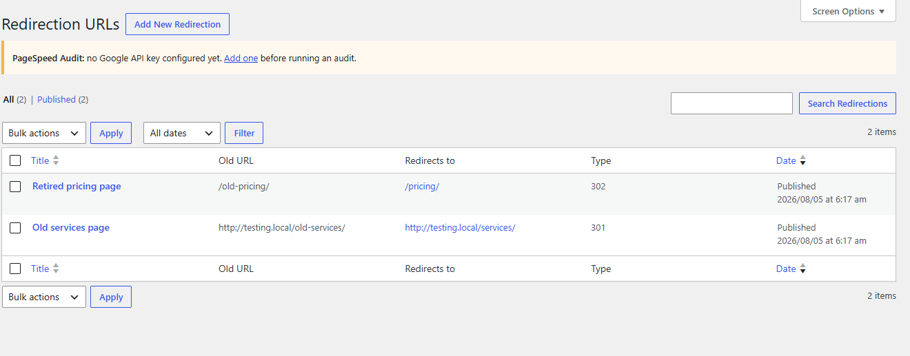
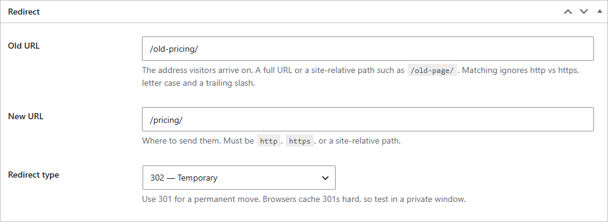
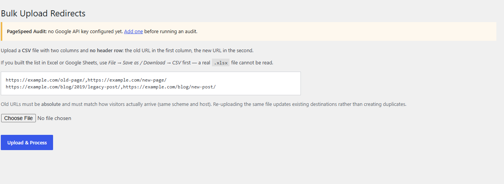

# Redirection URLs

> Manage 301 / 302 / 307 redirects one at a time or in bulk from a CSV. Built for SEO migrations, where you have a spreadsheet of old URLs and need every one of them pointing somewhere sensible before launch.

**Version:** 1.1.0
**Author:** Noman Nadeem
**Requires:** WordPress 5.0+, PHP 7.0+
**License:** GPL-2.0-or-later
**Dependencies:** none

---

## Screenshots

The list table shows the destination and the status code at a glance, so an audit does not mean opening every row.



Each redirect takes an old URL, a new URL and a status code.



Bulk upload takes a two-column CSV and reports what it did.



---

## What it does

Each redirect is stored as a hidden post with an old URL, a new URL and a status code. On every front-end request the plugin compares the incoming URL against a cached map and, on a match, sends the browser to the destination.

Matching is deliberately forgiving about the things that trip SEO teams up:

| Difference | Matched? |
|---|---|
| `http://` vs `https://` | ✔ yes |
| Trailing slash present or missing | ✔ yes |
| `/Old-Page/` vs `/old-page/` | ✔ yes (case-insensitive) |
| Entered as `/old-page/` instead of the full URL | ✔ yes (relative paths are resolved against your site) |
| `?utm_source=…` appended by a campaign | ✘ no — query strings must match exactly |

---

## What changed in 1.1.0

The original version had holes that mattered on a live site. All of these are fixed:

- **The bulk import had no nonce and no capability check.** Any logged-in user — including a Subscriber — could POST a CSV to `admin-post.php` and create or overwrite redirects. Combined with the next item, that was a site-wide traffic-hijack vector. It now requires `manage_options` and a valid nonce.
- **The destination was never validated,** and `wp_redirect()` allows any host. A redirect could be pointed at `javascript:` or an attacker's domain. Destinations are now restricted to `http`, `https` or site-relative paths.
- **The meta box save had no nonce and no capability check** — a CSRF could silently rewrite where your pages redirect to.
- **Redirects were broken on subdirectory installs.** The current URL was built as `home_url(add_query_arg([]))`, which duplicated the subfolder (`/blog/blog/old-page/`), so nothing ever matched.
- **Every page view queried and loaded every redirect post** plus two meta reads each. The map is now built once and cached in a transient, invalidated whenever a redirect is edited, deleted or imported.
- Added: a **redirect type selector** (301/302/307 — it was hardcoded 301), the **destination and type as list-table columns** (you could not see where anything pointed without opening it), **import result counts**, and a **self-redirect guard** so a rule pointing at itself cannot cause an infinite loop.
- The post type now requires `manage_options`. Previously Contributors and Authors could create redirects.

---

## Installation

Copy the `redirection-urls` folder into `wp-content/plugins/` and activate it. A **Redirects** menu appears in the sidebar. No configuration is needed.

---

## Adding a redirect

**Redirects → Add New Redirection**

| Field | Notes |
|---|---|
| Title | For your own reference — use the old path |
| Old URL | A full URL or a site-relative path such as `/old-page/` |
| New URL | Where to send them. Must be `http`, `https`, or site-relative |
| Redirect type | **301** permanent (passes SEO value), **302** temporary, **307** temporary keeping the request method |

Publish, and it is live immediately.

> Browsers cache 301s aggressively. Always test in a private window, and prefer 302 while you are still deciding.

The list table shows **Old URL**, **Redirects to** and **Type** at a glance, so an audit does not mean opening every row.

---

## Bulk import

**Redirects → Bulk Upload**

The file must be a plain **CSV** with **two columns and no header row** — old URL first, new URL second:

```
https://example.com/old-page/,https://example.com/new-page/
https://example.com/blog/2019/legacy-post/,https://example.com/blog/new-post/
/another-old-path/,/another-new-path/
```

If you built the list in Excel or Google Sheets, use **File → Save as / Download → CSV** first. A real `.xlsx` workbook is a zip archive and cannot be read — the plugin will tell you so rather than importing garbage.

After the upload you get a count: *"Import finished: 42 added, 3 updated, 1 skipped."*

Rows are skipped when they have fewer than two columns, when either URL is empty, or when the destination is not a valid `http`/`https`/relative target. That means a stray header row or a trailing blank line is dropped cleanly instead of creating junk records.

Re-uploading the same file **updates** existing destinations rather than creating duplicates — matching is on the old URL.

---

## Using it on a different website

| Concern | Behaviour |
|---|---|
| Subdirectory installs | Supported |
| Caching plugins | Redirects run on `template_redirect`, so a full-page cache can serve the old page before PHP runs. Exclude redirected URLs, or handle those rules at the server level |
| Other redirect plugins | The class names are unprefixed (`Redirection_CPT`, `Redirection_Handler`…). Running this alongside another plugin that uses the same names would be a fatal error |
| Scale | The map is cached, so cost is one transient read per request. Comfortable into the low thousands of rules |
| Multisite | Per-site; untested as a network plugin |
| Uninstall | Redirects stay in the database. Delete them before removing the plugin if you want them gone |

---

## Technical reference

**Storage** — post type `redirection_url` (`public => false`, `show_ui => true`, `manage_options` throughout), with post meta `_old_url`, `_new_url` and `_redirect_type`. No custom tables, no options.

**Cache** — the transient `redirection_urls_map` holds a normalised `old => {url, code}` map for 24 hours, flushed on `save_post_redirection_url`, `deleted_post`, `trashed_post`, `untrashed_post`, and after an import.

**Normalisation** — `Redirection_Handler::normalise()` lowercases the host, drops the scheme, resolves relative paths against `home_url()`, forces a trailing slash on the path and keeps the query string.

**Admin screens**

| Screen | URL |
|---|---|
| All Redirects | `/wp-admin/edit.php?post_type=redirection_url` |
| Add New | `/wp-admin/post-new.php?post_type=redirection_url` |
| Bulk Upload | `/wp-admin/edit.php?post_type=redirection_url&page=redirection-import` |

**Hooks** — none exposed. `Redirection_Handler::clean_url()`, `::normalise()`, `::is_valid_target()`, `::get_map()` and `::flush_cache()` are public statics you can call directly.

---

## Known limitations

- **Query strings must match exactly.** A campaign parameter appended to an old link defeats the rule. There is no ignore-params option.
- **No wildcards or regex** — every redirect is one exact URL.
- **No 404 log and no hit counter.** There is no way to see whether a rule has ever fired, or to discover which 404s still need redirecting.
- **Rules run on every request, not only on 404s.** A rule whose old URL matches a live page will redirect that page away.
- **No chain detection.** A → B alongside B → A is caught only for the exact self-redirect case; a longer loop is not.
- No enable/disable toggle, no expiry, no grouping, no export.
- Uninstalling leaves all redirects in the database.
- No i18n; all strings are hard-coded English.
