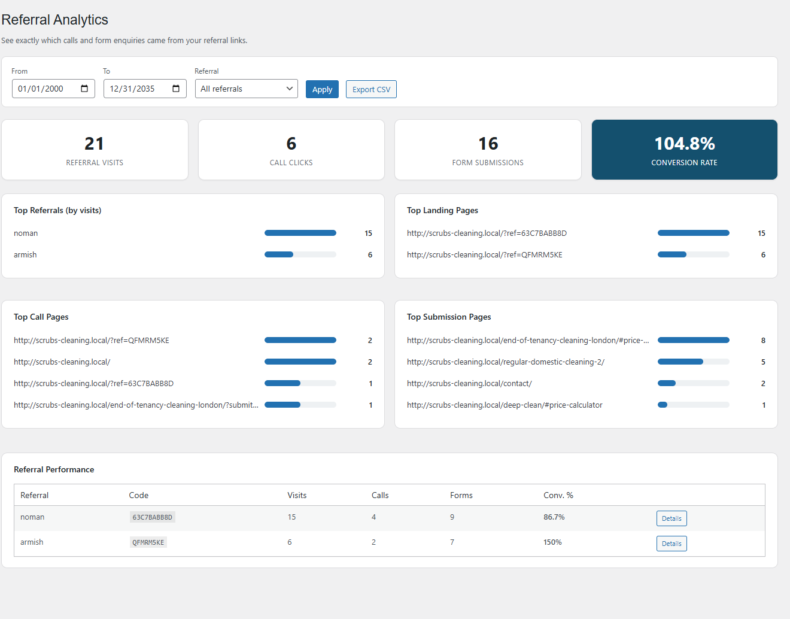
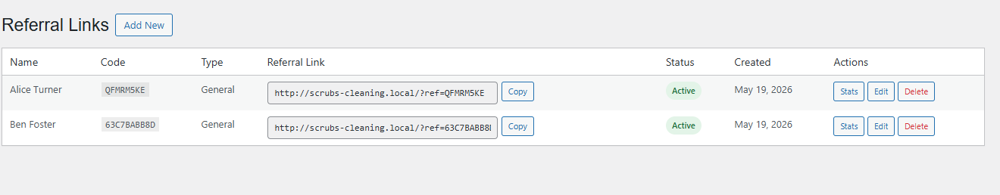
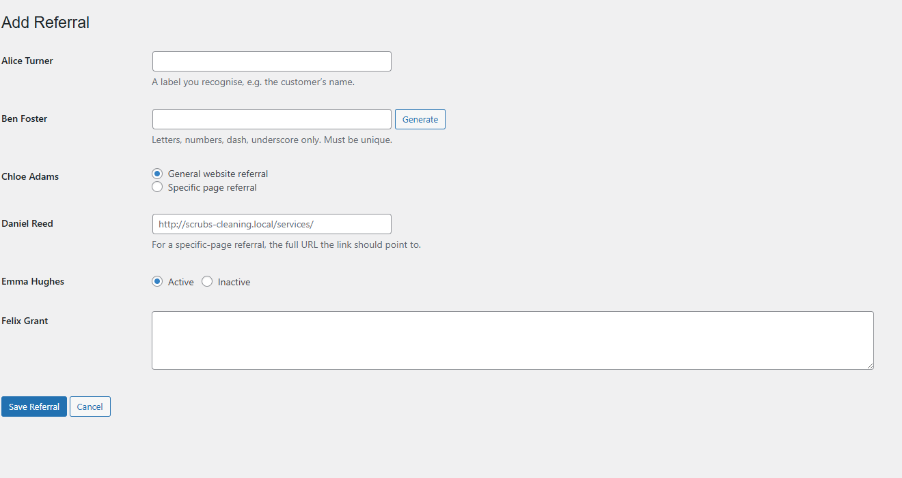
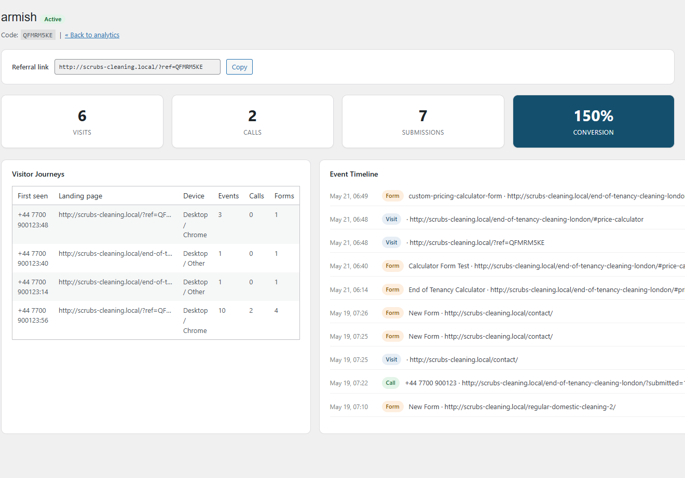
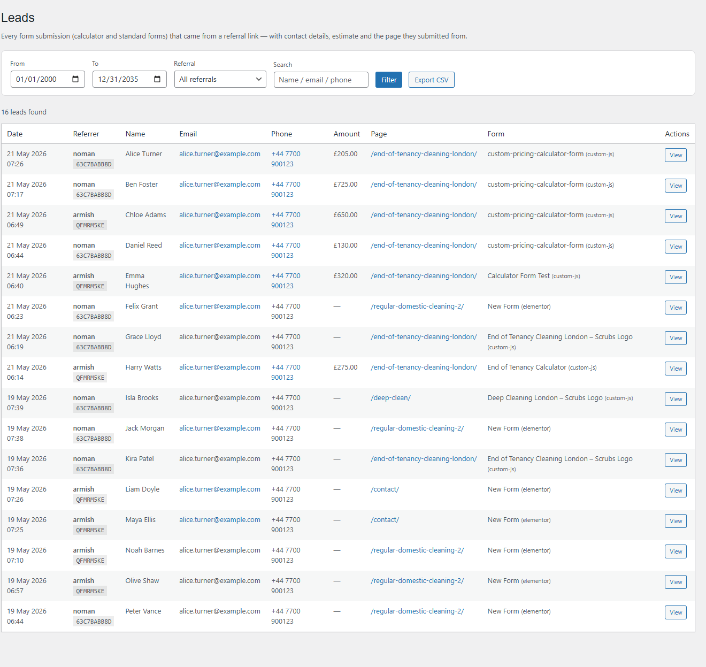
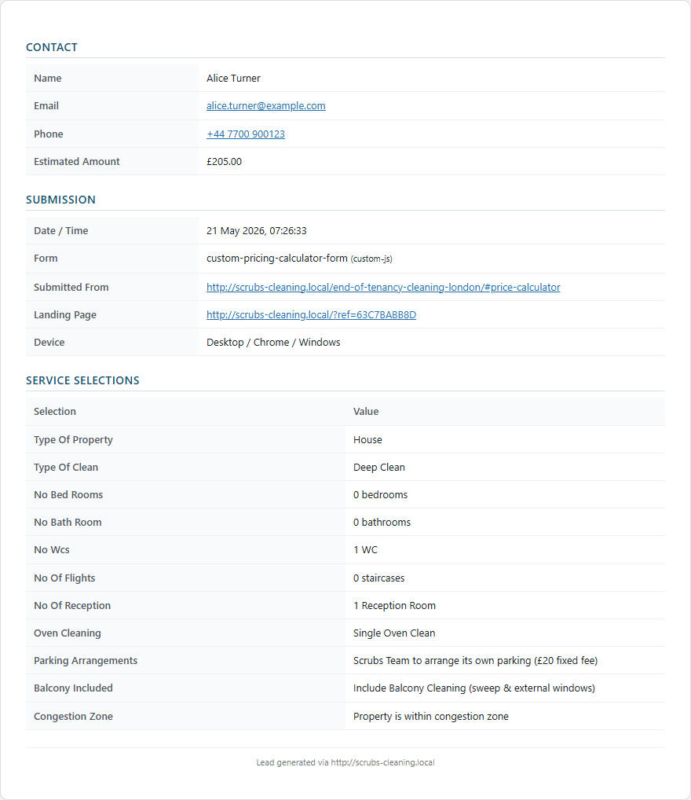
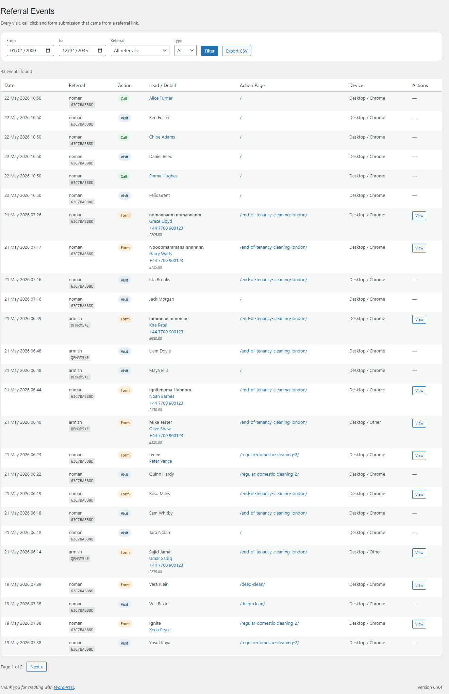
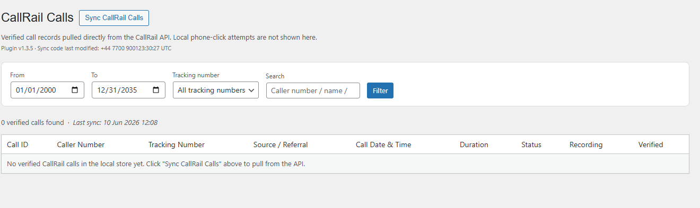
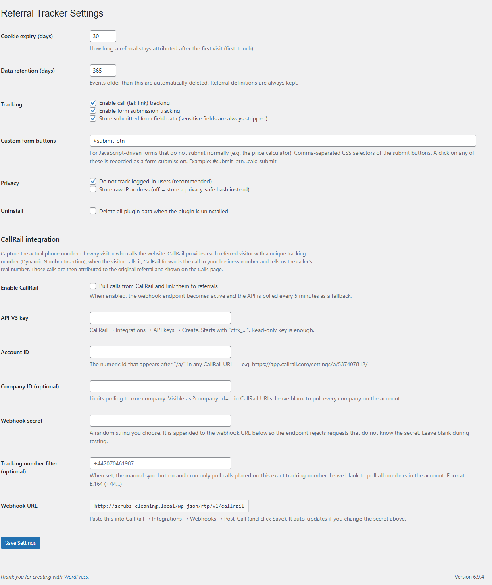

# Referral Tracker Pro

> Give each referrer their own link, then see exactly which visits, phone calls and form enquiries came from it — with the caller's real number and the customer's full quote, in a dashboard a non-technical person can read.

**Version:** 1.3.5
**Author:** Noman Nadeem
**Requires:** WordPress 5.6+, PHP 7.2+
**License:** GPL-2.0-or-later
**Dependencies:** none — no Composer, no npm, no charting library (the bars are pure CSS)

---

## Screenshots

*All customer names, emails and phone numbers below were replaced with demo values before capture.*

### Analytics dashboard

Four KPI tiles, four ranked breakdowns, and a per-referral performance table with conversion rates. Filter by date range and referrer, export to CSV.



### Referral links

Every referrer gets a named link with a unique code. The link is right there with a one-click **Copy** button.



Creating one takes a name, a code (or click **Generate**), and whether it points at the home page or a specific page.

| Add | Edit |
|---|---|
|  |  |

Clicking **Stats** on any referrer opens its all-time performance, the visitor journeys behind it, and a full event timeline.



### Leads

Every form submission attributed to a referrer, with contact details, the quoted amount, the page it came from and which form was used.



Open any lead for a printable sheet — contact block, submission details, and every option the customer picked in the quote calculator. The **Download / Print PDF** button prints just this card.



### Events

The raw stream — every visit, `tel:` click and form submission, filterable by type.



### CallRail — verified calls

Real call records pulled from the CallRail API: the caller's actual number, duration, status, recording, and which referral link brought them.



### Settings



---

## What it tracks

Three event types, and nothing else:

| Event | How it's captured | What it means |
|---|---|---|
| **Visit** | A page view by someone carrying a referral attribution | One per URL path per browser tab |
| **Call click** | A click on any `<a href="tel:…">` link | **Intent only** — nobody can tell from the browser whether the call connected. For verified calls, use CallRail |
| **Form submission** | Server-side hooks for CF7 / WPForms / Gravity Forms / Elementor Pro, plus a generic `<form>` fallback, plus a click-based path for JavaScript calculators | A real enquiry, with the lead's details extracted |

Alongside each event it records the **device, browser and OS**, the **landing page**, the **referrer URL**, and any **UTM parameters** — and from form submissions it pulls out the **name, email, phone and quoted amount** by fuzzy-matching field names, so it works across Elementor's `form-field-*` ids, CF7's `your-email`, WPForms labels and so on.

---

## How attribution works

Attribution is created **only** when a URL carries `?ref=CODE`. There is no guessing from the HTTP referrer and no UTM-based attribution — UTMs are recorded as metadata, not as the source.

- On the first referred page load the tracker stores `{code, sessionId, landingPage, timestamp, utm}` in **both** localStorage and a cookie named `rtp_ref` (the cookie is what server-side form hooks read, so attribution survives full-page caching).
- **First touch wins, absolutely.** If a store already exists and hasn't expired, a later `?ref=` does **not** overwrite it. A visitor who arrives via referrer A and returns via referrer B stays credited to A.
- The **attribution window** is `cookie_expiry_days` — 30 days by default, adjustable 1–365.
- Every event is re-validated server-side: the code must match an **active** referral, and the session id must look like a session id.

> **Testing tip:** "Do not track logged-in users" is on by default, so you must test in a logged-out or incognito window. Add `&rtp_debug=1` to the URL to get `[RTP]` logs in the browser console explaining exactly what was tracked and what was skipped.

---

## Installation

1. Copy the `referral-tracker-pro` folder into `wp-content/plugins/` (or upload the zip via **Plugins → Add New → Upload**).
2. Activate it. That creates four tables, writes the default settings and schedules the daily cleanup.
3. A **Referrals** menu appears in the sidebar.

---

## Setup

### 1. Referrals → Settings

| Setting | Default | What it does |
|---|---|---|
| Cookie expiry (days) | `30` | How long a referral stays credited after the first click. Range 1–365 |
| Data retention (days) | `365` | Events and sessions older than this are deleted daily. Referral definitions are never auto-deleted. Range 7–3650 |
| Enable call (tel:) tracking | on | Records clicks on `tel:` links |
| Enable form submission tracking | on | Records form submissions |
| Store submitted form field data | **off** | Stores the full field dump, which is what fills the "Service Selections" table on the lead sheet. Sensitive fields are always stripped |
| Custom form buttons | `#submit-btn` | Comma-separated CSS selectors for JavaScript-driven forms that never fire a real `submit` |
| Do not track logged-in users | on | Recommended — otherwise your own admin browsing pollutes the data |
| Store raw IP address | off | Off stores a salted SHA-256 hash instead, which is not reversible |
| Delete all plugin data on uninstall | off | Read at uninstall time — decide before you remove the plugin |

### 2. Create a referral link

**Referrals → Referral Links → Add New**

- **Referral name** — a label you recognise, usually the referring customer's name.
- **Referral code** — type one, or click **Generate** for a random 8-character code (ambiguous characters like `0`/`O` and `1`/`I` are excluded).
- **Referral type** — *General* (link points at the home page) or *Specific page* (link points at a URL you choose).
- **Status** — only `active` codes are attributed.

Save, then use the **Copy** button to hand `https://yoursite.com/?ref=CODE` to the referrer.

### 3. Verify it

Open the link in an incognito window with `&rtp_debug=1` appended. Click a `tel:` link, submit a form, then check **Referrals → Events** for a Visit, a Call and a Form row.

If nothing appears, check in this order: were you logged out, is the code Active, did the URL really contain `?ref=`.

### 4. JavaScript calculators (optional)

Quote calculators built in Elementor often never fire a real `submit` event. For those:

- Put the submit button's CSS selector in **Custom form buttons** (e.g. `#submit-btn`, comma-separate several).
- Make sure the success redirect includes **`?submitted=1`**.

The plugin stashes the click, and only converts it into a real lead once a page loads with `?submitted=1` within two minutes. That way failed submissions never show up as leads. The recorded page is the calculator page, not the thank-you URL.

> The `?submitted=1` marker is hard-coded. If your form signals success differently, call the JS API from your own success callback instead:
> ```js
> window.RTPTracker.trackForm({ form_id, form_name, form_type, page, fields });
> ```

### 5. CallRail (optional)

CallRail's Dynamic Number Insertion shows each visitor a rotating tracking number. When they ring it, CallRail forwards the call and reports the caller's **real** number, the landing page, source and recording. This plugin ingests those records and attributes each one by reading `?ref=CODE` out of the landing page URL.

1. In CallRail: **Integrations → API keys → Create**. A read-only key is enough; it starts `ctrk_…`.
2. Note your **Account ID** — the number after `/a/` in any CallRail URL.
3. In **Referrals → Settings → CallRail integration**: tick **Enable CallRail**, paste the API key and Account ID, optionally a Company ID, invent a **Webhook secret**, and optionally set a **Tracking number filter** in E.164 form. Save.
4. Copy the generated **Webhook URL** and paste it into CallRail → **Integrations → Webhooks → Post-Call**, then save in CallRail.
5. Turn on Dynamic Number Insertion for the site in CallRail.
6. Go to **Referrals → CallRail** and click **Sync CallRail Calls** to backfill the last 30 days.

After that, calls arrive in real time via the webhook, and cron re-checks every 5 minutes as a fallback.

Credentials can also be set in `wp-config.php`, which takes precedence over the settings screen:

```php
define( 'RTP_CALLRAIL_API_KEY',         'ctrk_…' );
define( 'RTP_CALLRAIL_ACCOUNT_ID',      '537407812' );
define( 'RTP_CALLRAIL_COMPANY_ID',      '' );
define( 'RTP_CALLRAIL_TRACKING_NUMBER', '+441234567890' );
```

> ⚠️ **The constants are honoured by the manual sync and the webhook, but not by the 5-minute cron poll** — that reads the settings option directly. If you configure by constants only, automatic polling will not run. Put the values in the settings screen as well.

---

## Admin screens

Menu **Referrals** (`dashicons-share`, position 58). Every page requires `manage_options`.

| Screen | Slug | What it shows |
|---|---|---|
| **Analytics** | `rtp-analytics` | KPI tiles (visits, call clicks, form submissions, conversion rate), top referrals, top landing/call/submission pages, per-referral performance table. Date + referral filters, CSV export |
| **Referral Links** | `rtp-campaigns` | The referral list with copy-ready links, status badges, and Stats / Edit / Duplicate-free Delete actions |
| Add / Edit Referral | `rtp-campaigns&action=new\|edit` | Name, code (with Generate), type, target URL, status, notes |
| **Referral Detail** | `rtp-referral-detail&id=N` | All-time KPIs for one referrer, up to 50 visitor journeys, and a 100-event timeline |
| **Leads** | `rtp-leads` | Every form submission with name, email, phone, amount, page and form. Search + filters + CSV export |
| Lead Detail | `rtp-lead-detail&id=N` | Printable lead sheet — contact, submission details, all calculator selections |
| **Calls** | `rtp-calls` | Legacy CallRail rows stored in the events table — see the warning below |
| **CallRail** | `rtp-callrail` | Verified calls from the API with recordings, sync button, last-sync result and a raw API debug panel |
| **Events** | `rtp-events` | Every event, filterable by type |
| **Settings** | `rtp-settings` | Everything in the table above |

> ⚠️ **The "Calls" page is empty on any install newer than v1.3.0.** It queries the old events table (`event_type='call' AND form_type='callrail'`), but CallRail data now goes into its own `rtp_callrail_calls` table. Verified calls live on the **CallRail** page. The Calls CSV export has the same limitation.

> ⚠️ **Analytics KPIs do not include CallRail calls.** "Call Clicks" counts browser `tel:` clicks only, so verified CallRail calls are excluded from the dashboard tiles, the charts and the conversion rate.

---

## Using it on a different website

| Concern | What to expect |
|---|---|
| Form plugins | CF7, WPForms, Gravity Forms and Elementor Pro are auto-detected — nothing to configure. Anything else falls back to the generic JS listener |
| Page caching | Safe. Attribution rides in a cookie that server-side hooks read, and the tracker is static JS |
| WooCommerce | Optional; only used to pick the currency symbol on the Leads page (falls back to `£`) |
| WP-Cron | Must work, or retention cleanup and CallRail polling never run. With `DISABLE_WP_CRON` set, point a real system cron at `wp-cron.php` |
| Multisite | Untested. Tables are per-site |
| Currency | The Leads page uses WooCommerce's symbol if present, otherwise a hard-coded `£` |
| Query parameter | `ref` is hard-coded and not filterable |
| Delegating access | Every screen is hard-coded to `manage_options` with no filter, so reports cannot be given to a non-admin role without editing the code |
| Timezones | Events and sessions store site-local time, but CallRail call times are stored in UTC. Far from UTC, day boundaries can disagree slightly between pages |

**Privacy and compliance, before you go live on a client site**

- The tracking cookie is set **unconditionally** on referred visits — there is no cookie-consent gate. If the site needs consent-first tracking, you must gate the script yourself.
- The plugin registers **no GDPR personal-data exporter or eraser**, and adds no privacy-policy text. Leads contain names, emails and phone numbers; CallRail rows contain real caller numbers and recording URLs.
- Anyone with `manage_options` can read every lead and every caller number. There is no finer-grained capability.
- Leave **Store raw IP address** off unless you have a lawful basis — the default is a salted, non-reversible hash.
- The **CallRail API key is stored in plain text** in the options table and rendered in a plain text input (not a password field).
- **`rtp_callrail_calls` is never purged** by the retention cron and is not dropped on uninstall, so caller numbers and full API payloads accumulate indefinitely. Clean it manually if you need to.

---

## Technical reference

### Files

```
referral-tracker-pro/
├── referral-tracker-pro.php      bootstrap, constants, loader
├── uninstall.php                 optional data removal
├── includes/
│   ├── class-rtp-activator.php       tables, defaults, cron scheduling
│   ├── class-rtp-deactivator.php     unschedules cron (keeps data)
│   ├── class-rtp-database.php        schema, campaign CRUD, sessions, events, de-dupe
│   ├── class-rtp-helpers.php         settings, UA parsing, IP hashing, lead-field extraction
│   ├── class-rtp-settings.php        settings sanitisation
│   ├── class-rtp-tracker.php         script enqueue + the public REST endpoint
│   ├── class-rtp-form-integrations.php  CF7 / WPForms / Gravity / Elementor hooks
│   ├── class-rtp-cron.php            retention cleanup
│   ├── class-rtp-callrail.php        webhook + 5-minute poll
│   └── class-rtp-callrail-sync.php   CallRail API client, upserts, call table
├── admin/
│   ├── class-rtp-admin.php       menus, 7 admin-post handlers, 1 AJAX handler, 3 CSV exporters
│   ├── class-rtp-analytics.php   all reporting SQL
│   └── views/*.php               10 page templates
└── assets/
    ├── js/rtp-tracker.js         the front-end tracker
    ├── js/rtp-admin.js           lead modal, copy buttons, code generator
    └── css/rtp-admin.css         dashboard styling
```

### Database

Four tables, created with `dbDelta`:

| Table | Holds |
|---|---|
| `{prefix}rtp_campaigns` | The referral links — name, unique `code`, type, target URL, status, notes |
| `{prefix}rtp_sessions` | One row per visitor session — first-touch landing page, referrer, UTM JSON, hashed IP, device/browser/OS, first seen, last seen |
| `{prefix}rtp_events` | Every visit / call / form — page, phone number, form id/name/type, extracted lead name/email/phone/amount, optional full field JSON |
| `{prefix}rtp_callrail_calls` | Verified CallRail records — caller number and name, tracking number, source, referral code, start time (UTC), duration, status, recording URL, city/state/country, and the full `raw_payload` |

**Options:** `rtp_settings` (all 15 settings in one array), `rtp_db_version`, plus `rtp_callrail_last_sync_at`, `rtp_callrail_last_sync_result` and `rtp_callrail_last_debug`.

**Client-side storage:** cookie `rtp_ref` (read server-side), localStorage `rtp_ref_store`, sessionStorage `rtp_v_<path>` (visit de-dupe) and `rtp_pending_calc_form` (stashed calculator submission).

### REST endpoints

| Route | Method | Protection |
|---|---|---|
| `/wp-json/rtp/v1/event` | POST | Public. Logged-in exclusion, same-origin check, active-code requirement, 30 events/minute per session, 20-second de-dupe. **The `X-WP-Nonce` header is sent but not verified** |
| `/wp-json/rtp/v1/callrail` | POST | Public. Gated by the enable flag and a shared secret via `?token=` or `X-RTP-Token`, compared with `hash_equals`. **Accepts anything when no secret is set** |

### Cron

| Hook | Schedule | Does |
|---|---|---|
| `rtp_retention_cleanup` | daily | Deletes events and sessions older than `retention_days`. Campaigns and CallRail calls are never touched |
| `rtp_callrail_poll` | every 5 minutes | Pulls calls since the last cursor and upserts them |

### CallRail API

One endpoint, `GET https://api.callrail.com/v3/a/{account_id}/calls.json`, with an explicit `fields` list (CallRail's default response omits the attribution fields). Manual sync paginates at 100/page up to 50 pages (~5,000 calls); the cron poll fetches a single page since the last cursor. Every request writes a debug snapshot visible in the collapsible panel on the CallRail screen.

### Developer hooks

One filter:

```php
// Add your own never-store field-name fragments
add_filter( 'rtp_sensitive_field_patterns', function ( $patterns ) {
    $patterns[] = 'national_insurance';
    return $patterns;
} );
```

Two cron actions you can hook or fire manually: `rtp_retention_cleanup`, `rtp_callrail_poll`.

JavaScript API:

```js
window.RTPTracker.trackCall( '+441234567890' );
window.RTPTracker.trackForm({ form_id, form_name, form_type, page, fields });
window.RTPTracker.getReferral();   // -> {code, session} or null
```

There are **no** filters for the attribution window, the `ref` parameter name, event types, table names, the admin capability or export columns.

### Data hygiene

Field names matching any of `pass, pwd, card, cc-num, ccnum, cvv, cvc, security_code, iban, sortcode, account_number, acct, routing, ssn, payment, paypal, stripe, token, secret` are **never** stored, even with field storage enabled. A submission stores at most 40 fields, keys capped at 64 chars and values at 500.

### Uninstall

`uninstall.php` does nothing unless **Delete all plugin data on uninstall** was ticked. When it is, it drops `rtp_events`, `rtp_sessions` and `rtp_campaigns` and deletes `rtp_settings` / `rtp_db_version`.

**Never removed, in any case:** the `rtp_callrail_calls` table (including caller numbers and raw payloads) and the three `rtp_callrail_*` options.

---

## Known limitations

- The **Calls** page and its CSV export only ever show pre-1.3.0 rows.
- Analytics KPIs exclude verified CallRail calls.
- `tel:` tracking is click intent, not connected calls.
- The CallRail cron poll ignores the `wp-config.php` constants and never applies the tracking-number filter.
- CallRail rows are never purged and survive uninstall.
- Attribution is `?ref=` only, first-touch only, with no last-touch or multi-touch model and no per-referral override.
- Deleting a referral orphans its events — reports fall back to showing the raw code.
- The JS-calculator path hard-codes `?submitted=1` as the success signal.
- No time-series or trend chart, and no comparison to a previous period — the charts are ranked bar lists.
- Pagination is fixed at 25 rows on every list screen, with no screen-options control.
- No i18n: `load_plugin_textdomain()` points at a `/languages` folder that does not ship, and there is no `.pot` file.
- No `readme.txt`, no changelog file, no tests.
- The lead sheet's hidden-field list is tuned for a specific Elementor price calculator, so on other sites the "Service Selections" table may show more or fewer rows than expected.
