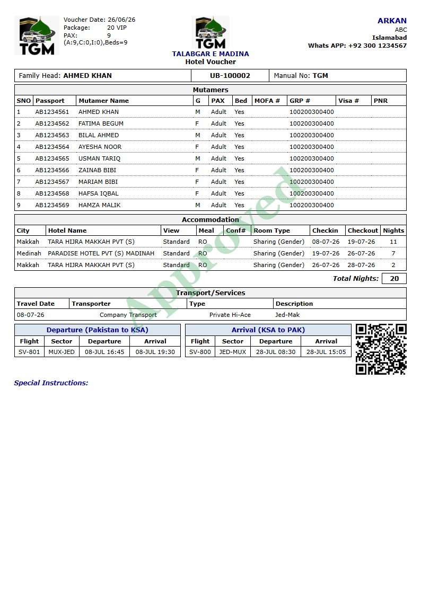
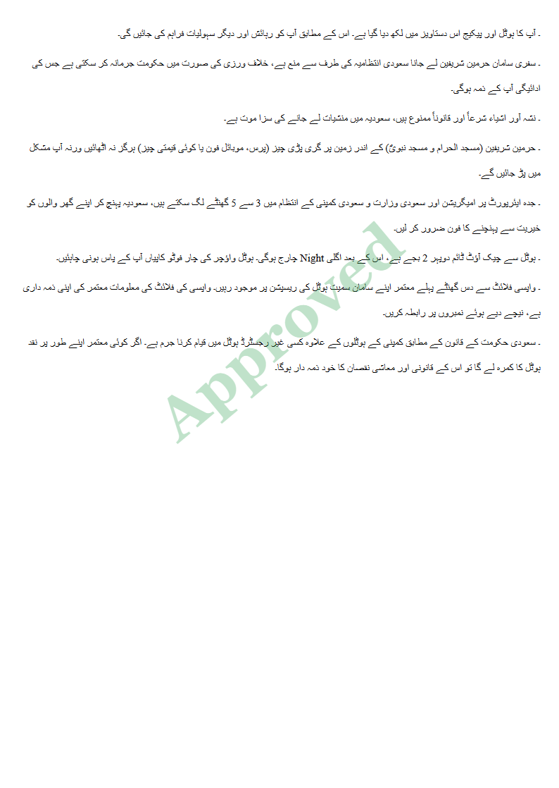
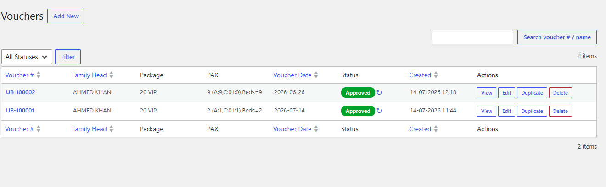
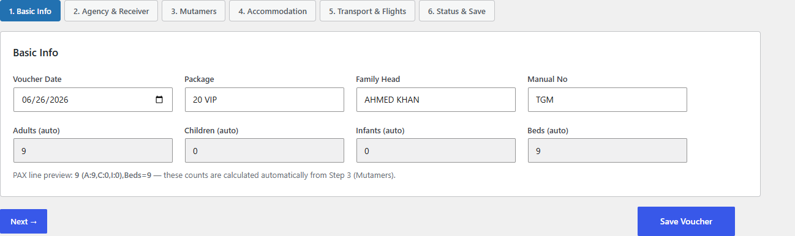
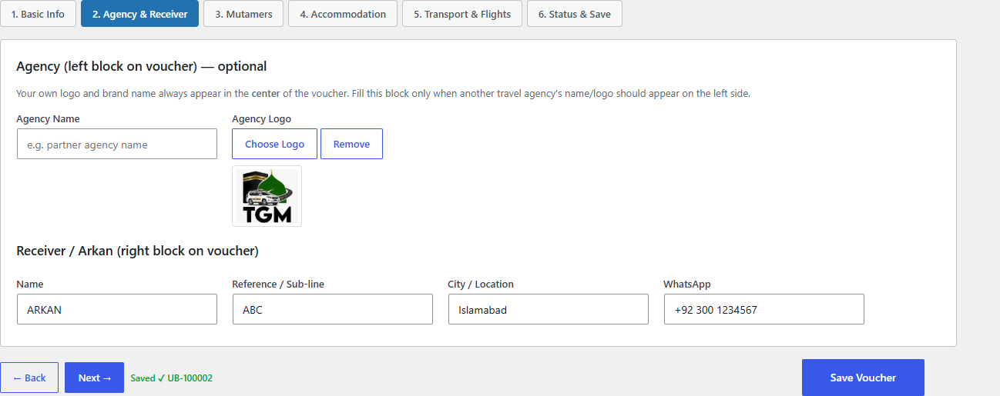
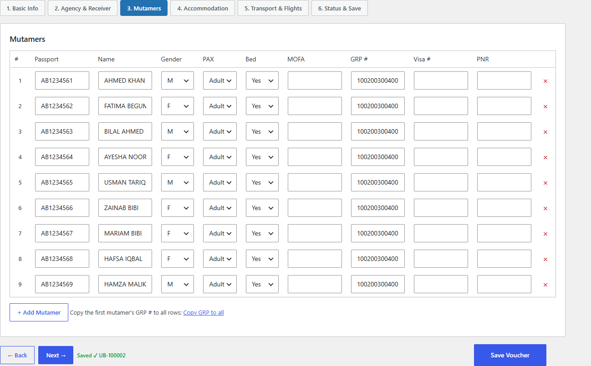
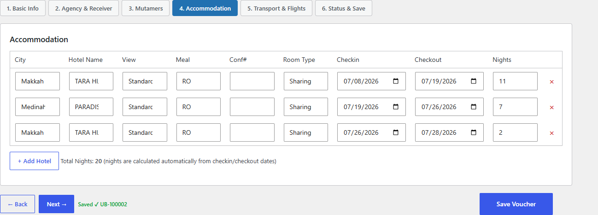
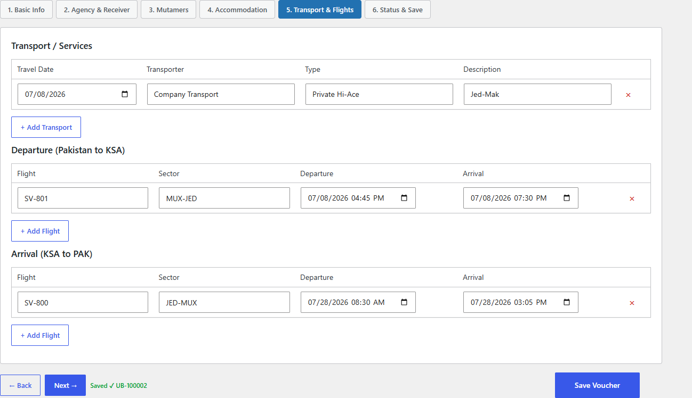
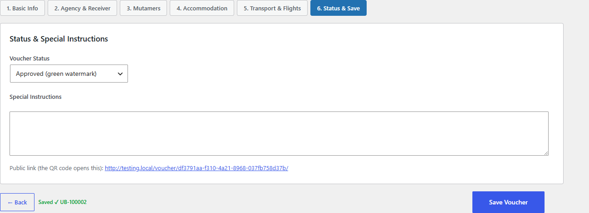
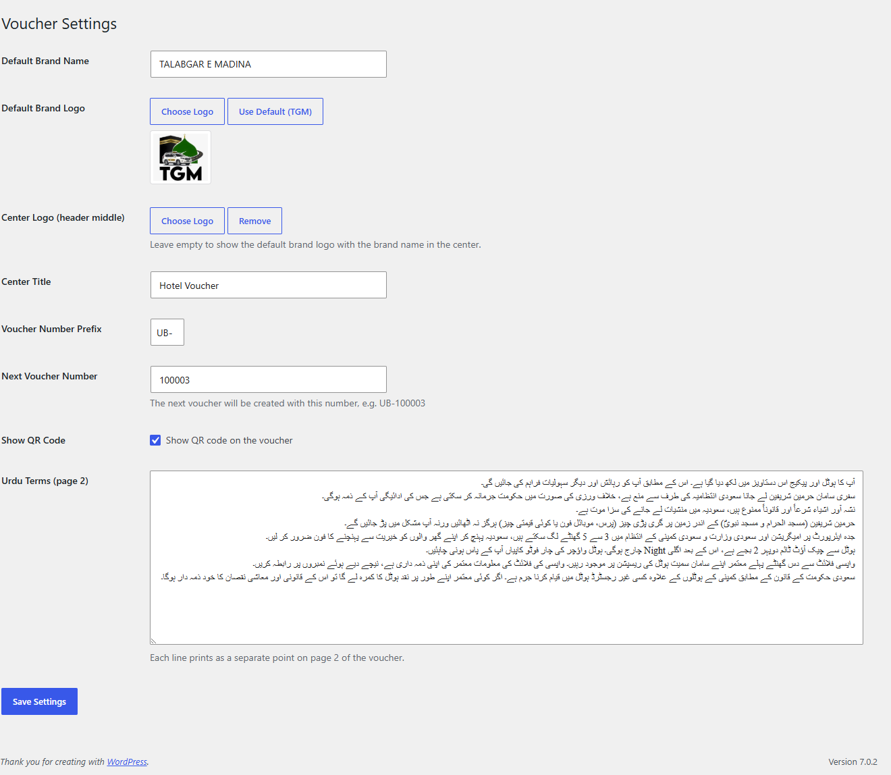

# TGM Voucher

> Travel voucher generator for Umrah / Hajj operators — six-step wizard, voucher list, QR code, and a print-ready A4 voucher with an Approved / Unapproved watermark.

**Version:** 1.0.0
**Author:** Noman Nadeem
**Requires:** WordPress 4.7+, PHP 7.0+
**Dependencies:** none (no WooCommerce, no PDF library, no Composer/npm build step)

---

## Screenshots

### The printed voucher

This is the whole point of the plugin — one A4 sheet, browser-printable, with the approval watermark across it.

<p align="center">
  
  
</p>

**Page 1** carries the three-block header (partner agency · your brand · receiver), the Mutamer manifest, accommodation with auto-calculated nights, transport, both flight tables and the QR code. **Page 2** is the Urdu terms sheet, right-to-left, one bullet per line from Settings.

### Admin — Vouchers



The list table with search, status filter, sortable columns, the PAX summary line, coloured status pills with a one-click toggle, and the View / Edit / Duplicate / Delete actions.

### The six-step wizard

**Step 1 — Basic Info.** Voucher date, package, family head, manual number. Adults / children / infants / beds are read-only; they are counted from step 3.



**Step 2 — Agency & Receiver.** Optional partner-agency block for the left of the voucher, and the Arkan/receiver block for the right.



**Step 3 — Mutamers.** One row per pilgrim. The green `Saved ✓ UB-100002` in the footer is the autosave firing on every step change.



**Step 4 — Accommodation.** Nights fill in automatically from check-in and check-out, and the total updates live.



**Step 5 — Transport & Flights.** Ground transport plus separate departure and arrival flight tables.



**Step 6 — Status & Save.** Approved or Unapproved (this drives the watermark colour), plus special instructions.



### Admin — Settings

Brand name, logos, centre title, number prefix and counter, QR toggle, and the editable Urdu terms.



---

## What this plugin is (and is not)

This is **not** a gift-voucher, coupon, discount or store-credit plugin. There is no money, no balance, no redemption and no code entry.

A "voucher" here is the **printable travel & hotel confirmation document** that a travel agency hands to pilgrims before departure. One voucher = one A4 sheet containing:

- Passenger (Mutamer) manifest — passport #, MOFA #, GRP #, visa #, PNR
- Hotel bookings in Makkah / Medinah — confirmation numbers, room type, check-in/out, nights
- Ground transport — Jed-Mak, Mak-Med, and so on
- Departure and return flight schedule
- A QR code that opens the online copy of the same voucher
- An optional second A4 page of Urdu terms & conditions

The only "status" is an approval flag, printed as a large diagonal watermark: green **Approved** or red **Unapproved**.

---

## Feature list

| Feature | Detail |
|---|---|
| Six-step wizard | Basic Info → Agency & Receiver → Mutamers → Accommodation → Transport & Flights → Status & Save |
| AJAX autosave | Saves on every step change; the first save converts "Add New" into "Edit" and rewrites the URL |
| Auto voucher numbers | Configurable prefix + counter: `UB-100001`, `UB-100002`, … |
| Five repeater tables | Mutamers, Hotels, Transport, Departure flights, Arrival flights — add/remove rows in place |
| Auto PAX totals | Adults / Children / Infants / Beds are counted from the Mutamer rows (read-only fields) |
| Auto hotel nights | Nights calculated from check-in / check-out, plus a live Total Nights figure |
| Learning autocomplete | Every save remembers hotel names, packages, transporters, sectors, flight numbers, cities and agency names, and offers them back as suggestions (last 50 per field) |
| Copy GRP to all | One click copies the first Mutamer's group number into every row |
| Voucher list table | Search, status filter, sortable columns, 20 per page |
| Row actions | View, Edit, Duplicate, Delete, plus a one-click status toggle (↻) |
| Public voucher page | Unguessable `/voucher/{uuid}/` URL, no login required, `noindex, nofollow` |
| Print-ready A4 | True A4 page size, forced page breaks, one-click Print / Save as PDF |
| Watermark | "Approved" (green) or "Unapproved" (red), rotated −40°, 30% opacity, on both pages |
| QR code | Points at the voucher's own public URL; can be switched off |
| Urdu terms page | Fully editable in Settings, RTL Nastaliq, one line = one printed bullet |
| Three-block header | Partner agency (left, per voucher) · your brand (centre, global) · receiver/Arkan (right, per voucher) |
| Media Library logo pickers | Brand logo, centre logo, and per-voucher agency logo |

**Deliberately not included:** email sending, PDF library (browser Print-to-PDF is used instead), WooCommerce integration, shortcodes, REST API, CSV import/export, custom roles, translations.

---

## Installation

1. Copy the `tgm-voucher` folder into `wp-content/plugins/`, or zip it and use **Plugins → Add New → Upload Plugin**.
2. **Plugins → Activate** "TGM Voucher".
   Activation registers the custom post type, flushes rewrite rules, and seeds the default settings, the voucher counter (`100001`) and an empty suggestions store.
3. Go to **Settings → Permalinks → Save Changes** once, so `/voucher/{uuid}/` resolves.
   If permalinks are set to *Plain*, the plugin automatically falls back to `?tgmv_uuid=…` links — everything still works.

Only users with the `manage_options` capability (Administrators) can see or use the plugin.

---

## First-time configuration — Vouchers → Settings

| Setting | Default | What it does |
|---|---|---|
| Default Brand Name | your site's name | Printed in the centre header block |
| Default Brand Logo | bundled TGM logo | Fallback logo; **Use Default (TGM)** restores it |
| Centre Logo | empty | Overrides the brand logo in the centre block; leave empty to reuse the brand logo |
| Centre Title | `Hotel Voucher` | Line under the brand name, e.g. "Umrah Voucher" |
| Voucher Number Prefix | `UB-` | Prepended to the counter |
| Next Voucher Number | `100001` | The number the next new voucher will take |
| Show QR Code | on | Prints a QR linking to the public voucher page |
| Urdu Terms (page 2) | 8 preset lines | One line per printed bullet; **clear it entirely to suppress page 2** |

> **Re-branding for another agency needs no code changes** — change the brand name, logos, centre title, prefix and terms, and the voucher is fully yours. The only remaining "TGM" traces are the plugin slug and internal prefixes.

> ⚠️ **Next Voucher Number has no collision check.** Setting it backwards can produce duplicate voucher numbers.

---

## Creating a voucher

**Vouchers → Add New**, then work through the six steps. Moving between steps autosaves.

**Step 1 — Basic Info**
Voucher Date · Package · **Family Head** · Manual No.
Adults / Children / Infants / Beds are read-only — they are calculated from Step 3.
*Family Head is effectively required: autosave will not run until it is filled, which prevents empty vouchers from burning voucher numbers.*

**Step 2 — Agency & Receiver**
The *Agency* block (name + logo) prints on the **left** of the voucher. Fill it **only** when another travel agency's branding should appear — your own brand always prints in the centre.
The *Receiver / Arkan* block (name, reference, city, WhatsApp) prints on the **right**.

**Step 3 — Mutamers**
One row per pilgrim: Passport · Name · Gender · PAX (Adult/Child/Infant) · Bed (Yes/No) · MOFA # · GRP # · Visa # · PNR.
The PAX and Bed columns drive the header PAX line — the server always recounts them, so the totals cannot be faked from the browser.
Use **Copy GRP to all** after entering the first group number.

**Step 4 — Accommodation**
City · Hotel · View · Meal · Conf# · Room Type · Check-in · Check-out · Nights.
Entering both dates fills Nights automatically and updates Total Nights.
Pre-seeded suggestions: cities Makkah / Medinah · views Standard / Haram View · meals RO / BB / HB / FB · room types Sharing / Double / Triple / Quad / Quint.

**Step 5 — Transport & Flights**
Three tables: Transport/Services (travel date, transporter, type, description), Departure (Pakistan → KSA), Arrival (KSA → Pakistan).
Pre-seeded suggestions: transport types Private Hi-Ace / Coaster / Bus / GMC · descriptions Jed-Mak, Mak-Med, Med-Jed, Jed-Mak-Med-Jed · sectors MUX-JED, JED-MUX, LHE-JED, ISB-JED, KHI-JED and their reverses.

**Step 6 — Status & Save**
Pick **Approved** (green watermark) or **Unapproved** (red watermark), add Special Instructions, then click **Save Voucher**.

---

## Printing and sharing

1. Open the voucher via the **View Voucher** button or the **View** row action — it opens the public page in a new tab.
2. Click **🖨 Print / Save PDF** (top-right, hidden when printing).
3. In the browser print dialog: paper **A4**, margins **None / Default**, and **enable "Background graphics"** — otherwise the watermark and the coloured table headers will not print.
4. Choose *Save as PDF* to get a file, or print directly.
5. Share the URL, or let the pilgrim scan the printed QR code — both open the same live page.

The public page bypasses your theme completely (it prints its own self-contained HTML), so theme CSS can never break the layout.

---

## Managing vouchers — Vouchers → All Vouchers

| Column | Sortable |
|---|---|
| Voucher # (links to edit) | ✔ (default, DESC) |
| Family Head | ✔ |
| Package | — |
| PAX — e.g. `9 (A:9,C:0,I:0),Beds=9` | — |
| Voucher Date | ✔ |
| Status — coloured pill + `↻` toggle | — |
| Created | ✔ (default, DESC) |
| Actions | — |

- **Search** matches both the voucher number and the family head (titles are stored as `UB-100066 — AYAAN RAFIQ`).
- **Filter** by All / Approved / Unapproved.
- **Duplicate** clones everything, mints a new number and a new UUID, and resets the status to Unapproved — ideal for repeat groups on the same package.
- **Delete is permanent.** It force-deletes and bypasses the trash. There is a JS confirm, but no undo.

---

## Using it on a different website

Everything below is site-agnostic; nothing is hard-coded to one domain or one agency.

| Concern | Behaviour on a fresh site |
|---|---|
| Branding | Fully configurable in Settings — no file edits needed |
| Permalinks | Pretty permalinks → `/voucher/{uuid}/`. Plain permalinks → automatic `?tgmv_uuid=…` fallback |
| Theme | Irrelevant — the voucher page renders standalone and ignores the theme |
| Page builders | No conflict; the plugin has its own admin UI and its own front-end route |
| Multisite | Untested. The CPT and options are per-site, so it should behave per-site, but rewrite flushing is not network-aware |
| Other plugins | No shortcodes, no `the_content` filters, no WooCommerce hooks — a very small conflict surface |
| Migration | Vouchers are just posts + post meta, so a normal DB export/import carries them over. **The public URL changes only if the domain changes; the UUID stays the same** |
| Existing content | The CPT is `public => false, show_ui => false`, so vouchers never appear in your normal admin lists, search, sitemaps or feeds |

**Things to plan for before going live on a client site:**

- **Access control.** Public voucher pages are protected only by the unguessable UUID — anyone with the link can view them, and links never expire. Do not put anything on a voucher you would not accept being seen by whoever the pilgrim forwards it to.
- **QR privacy / uptime.** The QR image is generated by the third-party service `api.qrserver.com`, requested from the *viewer's* browser at render time. If the viewer is offline or the service is down, the QR shows as a broken image. Turn it off in Settings if outbound third-party requests are unacceptable.
- **Urdu fonts.** For the best page-2 rendering, install *Jameel Noori Nastaleeq*, *Noto Nastaliq Urdu* or *Urdu Typesetting* on the machine that prints. The plugin ships no webfont and falls back to a generic serif.
- **Browser.** Chrome or Edge recommended — the wizard relies on `date` / `datetime-local` inputs and `<datalist>`; Firefox's `datetime-local` support is weaker.
- **Uninstall leaves data behind.** There is no `uninstall.php`, so deleting the plugin keeps every voucher and every option in the database. Reinstalling picks up exactly where you left off (which is usually what you want, but it means "clean removal" is a manual job).

---

## Technical reference

### Files

```
tgm-voucher/
├── tgm-voucher.php               bootstrap, constants, CPT, rewrite rule, activation
├── assets/
│   ├── admin.css                 admin styles (wizard, repeaters, list table columns)
│   ├── admin.js                  step navigation, autosave, repeaters, calculations, media picker
│   └── tgm-logo.png              bundled fallback brand logo (276×239)
├── includes/
│   ├── class-tgmv-data.php       data layer — sanitize, save, load, duplicate, suggestions
│   ├── class-tgmv-settings.php   settings store and defaults
│   ├── class-tgmv-frontend.php   public route + rendering
│   ├── class-tgmv-admin.php      menus, assets, all form/AJAX handlers, page renderers
│   └── class-tgmv-list-table.php WP_List_Table subclass
└── templates/
    └── voucher.php               the printable A4 document
```

All classes are fully static — no instances, no singleton, no DI.

### Data storage

No custom tables are created.

**Post type:** `tgm_voucher` — `public => false`, `show_ui => false`, supports `title` only. Titles are stored as `{voucher_no} — {family_head}`.

**Post meta**

| Key | Purpose |
|---|---|
| `_tgmv_data` | The entire voucher payload (serialised array, 21 top-level keys including the 5 repeaters) |
| `_tgmv_uuid` | `wp_generate_uuid4()`, set once at creation — the public URL token |
| `_tgmv_voucher_no` · `_tgmv_family_head` · `_tgmv_package` · `_tgmv_status` · `_tgmv_voucher_date` | Flat copies, mirrored purely so `WP_Query` can sort and filter |

`TGMV_Data::load()` merges the stored array over `blank()`, so adding fields in a future version will not break existing vouchers.

**Options**

| Option | Autoload | Default |
|---|---|---|
| `tgmv_settings` | yes | 7 keys — brand_name, brand_logo, center_logo, center_title, prefix, show_qr, terms_urdu |
| `tgmv_next_number` | yes | `100001` |
| `tgmv_suggestions` | **no** | learned autocomplete values, max 50 per key |

### Front-end route

```
^voucher/([0-9a-fA-F\-]{36})/?$   →   index.php?tgmv_uuid=$matches[1]
```

`TGMV_Frontend::maybe_render()` hooks `template_redirect`, resolves the UUID, sends `nocache_headers()`, includes `templates/voucher.php`, then `exit`s. An unknown UUID returns a real 404. Rewrite rules are flushed on both activation and deactivation.

### Form and AJAX handlers

All require `manage_options` and a valid nonce.

| Action | Method | Effect |
|---|---|---|
| `tgmv_save_voucher` | POST | Sanitise + save → redirect to the edit screen with `saved=1` |
| `tgmv_save_settings` | POST | Update `tgmv_settings` (+ `tgmv_next_number` if a positive integer) |
| `tgmv_duplicate` | GET | Clone → new post, new number, new UUID, status reset |
| `tgmv_delete` | GET | `wp_delete_post($id, true)` — permanent |
| `tgmv_toggle_status` | GET | Flip approved ↔ unapproved, redirect back |
| `tgmv_autosave` (AJAX) | POST | Returns `{voucher_id, voucher_no, view_url, edit_url}`. Logged-in only — there is no `nopriv` variant |

### Validation

- Text → `sanitize_text_field(wp_unslash())`; instructions → `sanitize_textarea_field`; logos → `esc_url_raw`; counts → `absint`.
- `status` is whitelisted — anything that is not literally `approved` becomes `unapproved`.
- Repeater rows are rebuilt column-wise and **fully empty rows are dropped**, so blank starter rows never persist.
- **PAX totals are recalculated server-side** and overwrite whatever the browser posted.
- There is **no required-field validation** on the Save button — a completely blank voucher can be saved manually.

### Developer surface

The plugin fires **no custom actions or filters** — there are no extension points. To integrate, call the static API directly:

```php
TGMV_Data::blank();
TGMV_Data::sanitize( array $raw );
TGMV_Data::save( array $data, int $post_id = 0 );   // 0 = create
TGMV_Data::load( int $post_id );
TGMV_Data::find_by_uuid( string $uuid );
TGMV_Data::public_url( int $post_id );
TGMV_Data::duplicate( int $post_id );
TGMV_Data::suggestions( string $key );
TGMV_Data::pax_line( array $data );

TGMV_Settings::defaults();
TGMV_Settings::get();
TGMV_Settings::brand_logo_url();
TGMV_Settings::default_terms();

TGMV_Frontend::fdate( $value, $format = 'd-m-y' );
TGMV_Frontend::fdatetime( $value );
```

---

## Known limitations

- Deleting a voucher is permanent — no trash, no undo.
- No bulk actions and no checkbox column in the list table.
- No required-field validation on manual save.
- No duplicate-number protection if *Next Voucher Number* is edited downward.
- No email, no server-side PDF, no export — distribution is browser print plus the public URL.
- Every UI string is hard-coded English/Urdu despite the declared `tgm-voucher` text domain; there is no translation coverage.
- Public voucher pages are unauthenticated (UUID-as-password) and never expire.
- QR codes depend on the external `api.qrserver.com` service.
- Uninstalling leaves all vouchers and options in the database.
- The "Special Instructions:" heading prints even when the field is empty.
- Hotel *cities* are never learned into the suggestion store — only the two seeded values (Makkah, Medinah) ever appear.

---

## Glossary

| Term | Meaning |
|---|---|
| **Mutamer** (معتمر) | A person performing Umrah — i.e. a passenger on the voucher |
| **MOFA #** | Saudi Ministry of Foreign Affairs number issued for the Umrah visa |
| **GRP #** | Group number tying passengers into one booking group |
| **PNR** | Airline booking reference |
| **Arkan / Receiver** | The receiving party in Saudi Arabia, printed in the right header block |
| **TGM** | The prefix used throughout the plugin's slugs, option keys and CSS classes, and the name of the bundled placeholder logo |
