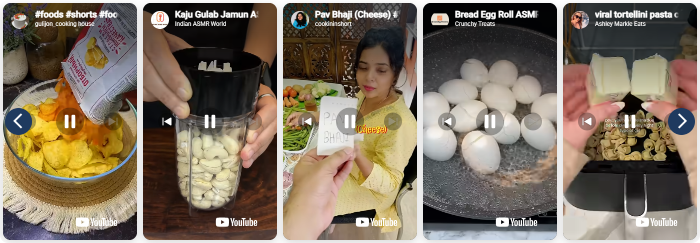
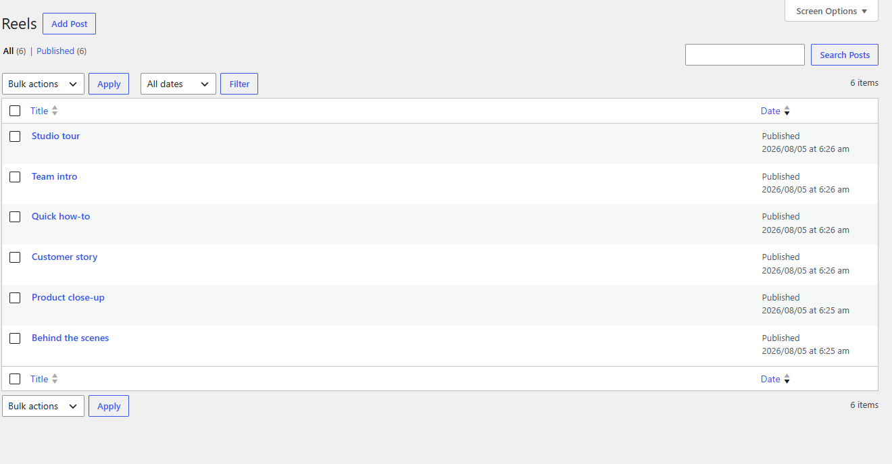

# YouTube Reels Carousel

> A full-width carousel of vertical YouTube videos that autoplay muted in the grid, and open in a centre-mode lightbox when clicked.

**Version:** 1.5.0
**Author:** Noman Nadeem
**Requires:** WordPress 5.0+, jQuery, [Advanced Custom Fields](https://wordpress.org/plugins/advanced-custom-fields/)
**Shortcode:** `[youtube_reels]`

---

## Screenshots

Five tiles per row, each one a live muted embed, with the previous/next arrows overlaid. These are real YouTube **Shorts** — vertical 9:16 video, which is what the tile is shaped for.



> **Use Shorts, not regular videos.** A standard 16:9 upload still plays, but it letterboxes inside the vertical tile with large black bands above and below. Paste `youtube.com/shorts/…` links (or any genuinely vertical video) and the frame fills properly, as above.

Reels are managed like any other post type.



---

## What it does

Each reel is a post in its own **Reels** post type. On the front end they render as a Slick carousel — five per row on desktop, scrolling two at a time — where every tile is a **live, muted, looping YouTube embed** rather than a static thumbnail. Clicking the play button opens a dark full-screen lightbox with a three-up centre-mode slider.

The video chrome is stripped (`controls=0`, no keyboard, no fullscreen button) so the grid reads as a wall of short-form video rather than a set of players.

---

## Installation and setup

**1. Install Advanced Custom Fields.** This plugin reads the video URL from an ACF field and does not register it for you — without ACF the carousel renders empty with no warning.

**2. Copy the folder** into `wp-content/plugins/` and activate it. A **Reels** menu appears in the sidebar.

**3. Create the ACF field:**

- **Custom Fields → Field Groups → Add New**, name it e.g. "Reel Video"
- Add one field: type **Text** (or URL), **field name exactly `video_url`**
- Location rule: **Post Type is equal to Reel**
- Publish

**4. Add reels.** Reels → Add New → give it a title (for your own reference — it is never displayed) → paste a YouTube URL into `video_url` → Publish.

Accepted URL formats — **prefer the Shorts form**, since the tiles are vertical:

```
https://www.youtube.com/shorts/VIDEOID      ← recommended
https://www.youtube.com/watch?v=VIDEOID
https://youtu.be/VIDEOID
https://www.youtube.com/embed/VIDEOID
<iframe src="https://www.youtube.com/embed/VIDEOID" …></iframe>
```

All five resolve to the same video id, so a Short pasted in `watch?v=` form works too. What matters is that the **video itself is vertical** — a landscape video will letterbox inside the tile.

**5. Place the shortcode** on any page:

```
[youtube_reels]
```

---

## Shortcode attributes

| Attribute | Default | Notes |
|---|---|---|
| `posts_per_page` | `-1` (all) | Set a number — see the performance note below |
| `aspect` | `9:16` | **Currently inert.** The value is written to a CSS variable the stylesheet does not read; tile height is fixed in `assets/css/yrc-reels.css` |
| `cover_scale` | `1` | **Currently inert**, same reason |

Reels are ordered by publish date, newest first. There is no ordering attribute — to reorder, change the publish dates.

```
[youtube_reels posts_per_page="10"]
```

> ⚠️ **Set `posts_per_page`.** The default loads *every* reel, and each one is a live YouTube iframe playing at once. Ten reels means ten simultaneous embeds and a lot of third-party requests. This is the single biggest thing to watch for Core Web Vitals.

---

## Layout

| Viewport | Per row | Scrolls |
|---|---|---|
| > 1400px | 5 | 2 |
| ≤ 1400px | 5 | 2 |
| ≤ 1200px | 4 | 2 |
| ≤ 992px | 3 | 2 |
| ≤ 768px | 2 | 1 |
| ≤ 480px | 1 | 1 |

The lightbox shows three at a time with the centre slide scaled up and the neighbours faded. Close it with the × button, a click on the backdrop, or Escape; `←` / `→` move between reels.

---

## Upgrading from an earlier build

On a fresh install there is nothing to do — skip this section.

If you are replacing an earlier, differently-named build of this plugin, two things changed and neither migrates on its own.

**1. The shortcode.** It is now `[youtube_reels]`. To keep pages that use the old name rendering, register it:

```php
add_filter( 'yrc_legacy_shortcodes', function ( $names ) {
    $names[] = 'my_old_shortcode_name';
    return $names;
} );
```

**2. The post type.** Reels now live under `yrc_reel`. Posts created by the old build stay in the database but are invisible until you move them:

```sql
UPDATE wp_posts SET post_type = 'yrc_reel' WHERE post_type = 'my_old_post_type';
```

Back up the database first, and substitute your old post type key. The ACF field name (`video_url`) is unchanged, so the videos themselves carry over untouched.

---

## Technical reference

**Files**

```
youtube-reels-carousel/
├── youtube-reels-carousel.php   CPT, assets, YouTube URL parser, shortcode
├── assets/css/yrc-reels.css     carousel + lightbox styling
├── assets/js/yrc-reels.js       Slick init, lightbox, keyboard handling
├── inc/templates.php            empty placeholder
└── readme.txt
```

**Post type** — `yrc_reel`, `public => true`, no archive, supports title / editor / thumbnail (none of which are rendered on the front end). Because it is public, single reels are reachable at `/yrc_reel/<slug>/`.

**Embeds** — grid tiles use `youtube-nocookie.com/embed/<id>` with `autoplay=1&mute=1&controls=0&loop=1&playlist=<id>&modestbranding=1&playsinline=1&rel=0`. Lightbox slides use `youtube.com/embed/<id>` with controls visible. Only three lightbox iframes exist at a time — the rest are emptied.

**Dependencies loaded from cdnjs** — Slick Carousel 1.8.1 CSS, theme CSS and JS. There is no local fallback, so a blocked CDN breaks the layout. This also means the plugin cannot be submitted to wordpress.org as-is.

**Storage** — no options, no custom tables, no transients. Reels are `wp_posts` rows plus the ACF `video_url` meta.

**Hooks** — none exposed. The only incidental filter is `shortcode_atts_yrc_reels`.

---

## Known limitations

- **ACF is required and unchecked.** No admin notice, no fallback — a missing `video_url` field produces an empty carousel silently.
- The `aspect` and `cover_scale` attributes do nothing; tile height is fixed in CSS.
- Assets load on every front-end page, not only pages containing the shortcode.
- Two shortcodes on one page create duplicate lightbox IDs.
- Grid videos keep playing behind an open lightbox — the YouTube IFrame API is never loaded, so they cannot be paused.
- The page still scrolls behind the open lightbox.
- Arrows and the close button are `div`s, so they are not keyboard focusable, and the lightbox has no focus trap or `role="dialog"`.
- The URL parser falls back to "any 11-character token", so a malformed URL can produce a broken embed instead of being skipped.
- CPT labels use WordPress defaults for most strings, so some admin screens read "Add New Post" rather than "Add New Reel".
- No i18n despite a declared text domain.
